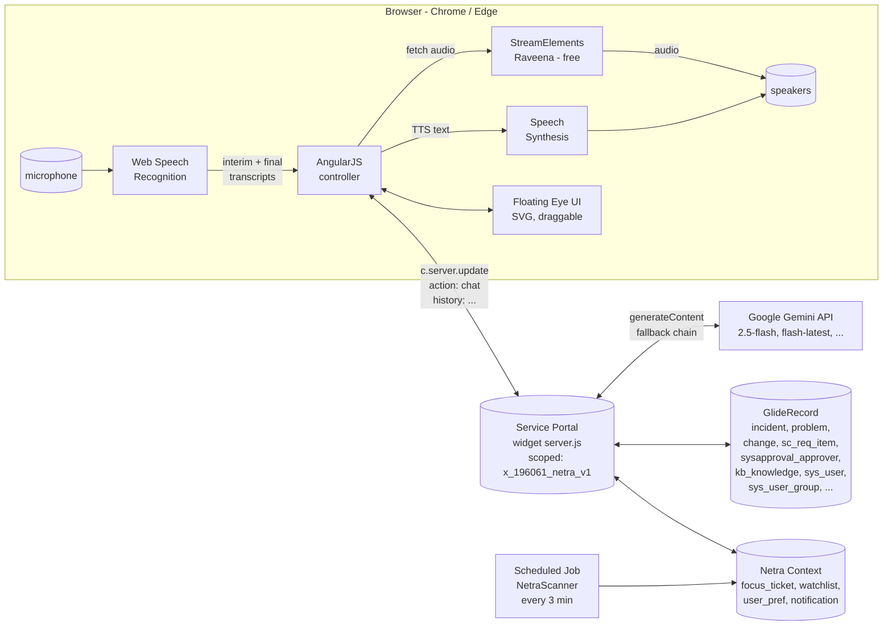
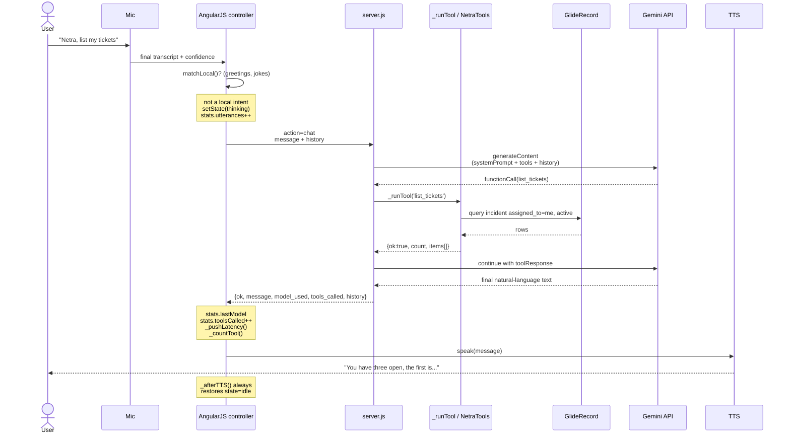
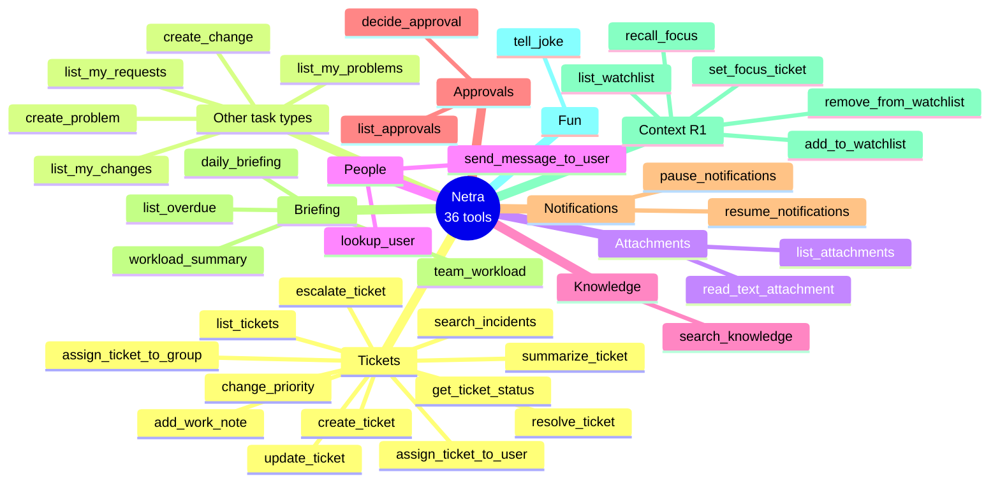
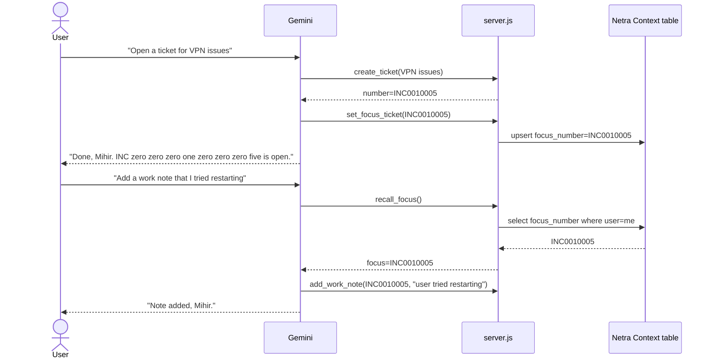
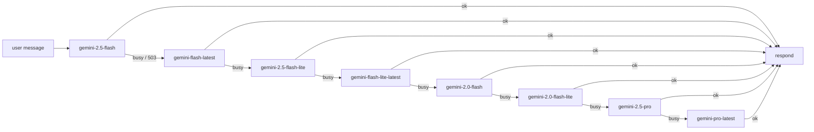
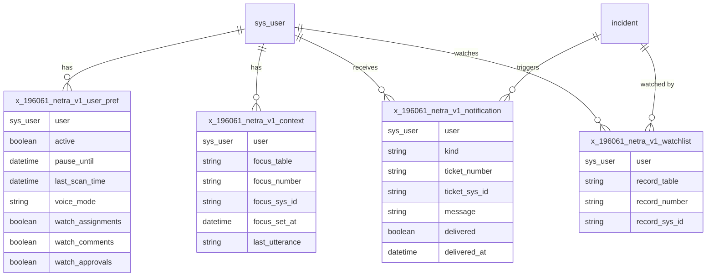
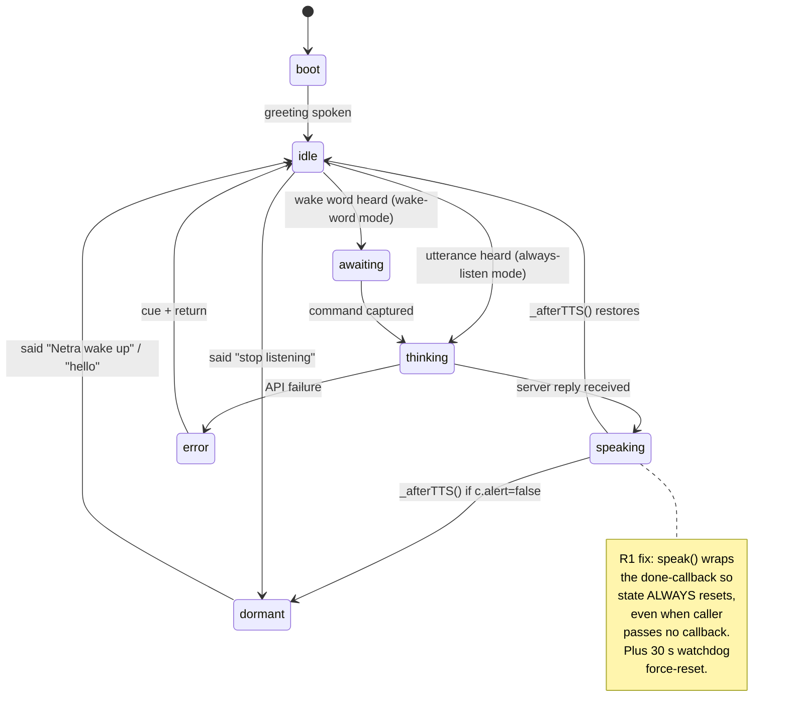
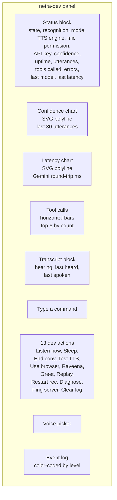

# Netra — Technical Design Document (Release 1)

**Document owner**: Mihir Kumar Singh, ServiceNow Architect (SecOps & GRC)
**Release**: R1 — first GA
**Last updated**: 2026-05-17
**Status**: SHIPPING

---

## 1. Executive summary

**Netra** (Sanskrit *नेत्र* — "eye") is a voice-controlled ServiceNow Service Portal assistant designed first and foremost for **blind and visually-impaired users**. Sighted helpers log the blind user in once; from then on the entire ServiceNow workflow — opening tickets, listing approvals, resolving incidents, sending messages, briefing on the day's workload — happens by voice in warm Indian English.

A small, calm, draggable eye sits on the page so a sighted helper can confirm Netra is alive. The blind user never has to look at it.

R1 is the first release that delivers:

- **Always-on speech recognition** — no wake word required, no 8-second windows. The mic is open continuously; the user just speaks.
- **36 Gemini-driven tools** spanning incidents, problems, changes, requests, approvals, knowledge base, attachments, watchlist, focus context, daily briefing, team workload.
- **Apple-serene eye UI** — draggable, shrinkable, edge-snapping floating button, no HUD lines or scanners.
- **Robust state machine** — mic-stuck-in-speaking bug fixed, watchdog + visibility-recovery added.
- **Free Indian English TTS** — StreamElements Raveena (no API key, no quota) with browser-Heera fallback.
- **Real-time dev panel** with live confidence/latency graphs and tool-call counts.
- **169-entry update set** captures every artifact for clean deployment to other instances.

---

## 2. Architecture at a glance



### Why this shape

| Boundary | Rationale |
|---|---|
| **All Gemini calls happen server-side** | API key never leaves the ServiceNow instance. The browser only ever sees a friendly reply text. |
| **Tool dispatch is local to the scope** | `_runTool()` switches on tool name and calls `NetraTools` / `NetraKnowledge` Script Includes via standard GlideRecord. No cross-scope leakage. |
| **TTS prefers remote (StreamElements Raveena)** | Free, no key, female Indian English. Browser TTS (Heera/Neerja) is the silent fallback when the public service hiccups. |
| **Speech recognition is single continuous session** | Web Speech `continuous = true` with `onend` auto-restart. Avoids the 8-second-window UX trap and matches blind users' expectations of a real assistant. |
| **Service Portal widget, not Workspace** | Service Portal renders cleanly for screen readers (JAWS, NVDA), is HTTPS by default on developer instances, and ships with AngularJS — which fits the lightweight always-on controller pattern. |

---

## 3. Command lifecycle (sequence diagram)



---

## 4. The eye — visual identity

The eye is the **only** UI element. No chat panel. No buttons (visible to the blind user). No keyboard required after initial gesture.

### Anatomy (SVG, viewBox 200×130)

```mermaid
flowchart TB
    subgraph SVG[netra-eye-svg]
        Halo[Backlit halo<br/>radial gradient]
        Sclera[Sclera<br/>warm cream gradient]
        IrisGroup[Iris group<br/>drift animation]
        Iris[Iris<br/>4-stop radial]
        Striations[Radial striations<br/>realism detail]
        Limbal[Limbal ring<br/>outer iris edge]
        Pupil[Pupil<br/>3-stop radial<br/>scale animation]
        Glint1[Primary catchlight<br/>upper-left]
        Glint2[Secondary catchlight<br/>lower-right]
        LidTop[Upper eyelid<br/>blinks + closes for dormant]
        LidBot[Lower eyelid<br/>blinks + closes for dormant]
        Lashes[Top + bottom lashes<br/>natural detail]
        Outline[Soft outer outline<br/>0.45 stroke]

        Halo --> Sclera
        Sclera --> IrisGroup
        IrisGroup --> Iris
        Iris --> Striations
        Striations --> Limbal
        Limbal --> Pupil
        Pupil --> Glint1
        Glint1 --> Glint2
        Glint2 --> LidTop
        LidTop --> LidBot
        LidBot --> Outline
        Outline --> Lashes
    end
```



### State palette

Each state remaps CSS custom properties so the *entire* iris recolours by remapping `--iris-bright`, `--iris-mid`, `--iris-dark`, `--iris-deep`, `--eye-glow`.

| State | Iris bright | Iris dark | Glow | When |
|---|---|---|---|---|
| IDLE | `#aedcff` warm cyan | `#0a2a4a` navy | `rgba(127,200,255,0.55)` | default, listening |
| AWAITING | `#ffd9a0` amber | `#3d260a` deep amber | `rgba(255,200,120,0.6)` | heard wake word, expecting command |
| LISTENING | `#ffb0a0` rosy | `#3d0a0a` deep red | `rgba(255,130,130,0.7)` | actively capturing utterance |
| THINKING | `#ffe5a0` gold | `#3d2700` warm gold | `rgba(255,210,100,0.6)` | Gemini round-trip |
| SPEAKING | `#b5e5c5` sage | `#0a3320` deep green | `rgba(140,220,170,0.6)` | TTS active |
| DORMANT | `#6a7480` grey | `#0a1018` near-black | `rgba(80,90,105,0.25)` | said "stop listening" — lids close |
| ERROR | `#ffa090` soft red | `#3d0a0a` deep red | `rgba(255,130,130,0.7)` | API failure — gentle shake |

### Animations (calm by design)

- `backlight-breathe` — 5 s halo opacity/scale breath (subliminal "alive")
- `pupil-breath` — 4.5 s gentle dilation
- `iris-drift` — 32 s micro-translate ±1 px (you don't see it, but it stops the eye feeling static)
- `glint-shimmer` — 7 s catchlight 0.95→0.75→0.95
- THINKING swaps pupil-breath to 1.5 s (eye visibly "thinking")
- DORMANT translates both lids 75 px toward centre (eye closes)

No HUD lines. No scanners. No corner brackets. Apple-serene.

### Behaviour

| Gesture | Result |
|---|---|
| Single click | Toggle sleep/wake (`c.alert` flips) |
| Double-click | Shrink/expand (Apple AssistiveTouch-style mini bubble) |
| Drag | Reposition anywhere on screen; on release snaps to nearest edge horizontally; persists in `localStorage["netra.orb.pos"]` |
| Alt+N | Same as click (keyboard equivalent) |
| Alt+D | Toggle dev panel |
| Esc | Stop Netra mid-sentence |

---

## 5. Tool catalogue (36 tools)



### Selected tool I/O contracts

| Tool | Input | Returns |
|---|---|---|
| `create_ticket` | `short_description`, `urgency` (1-3) | `{ok, number, sys_id, message}` |
| `daily_briefing` | — | `{ok, briefing, counts:{incidents,problems,changes,requests,approvals,watching}, greeting}` |
| `set_focus_ticket` | `ticket_number` | persists into `x_196061_netra_v1_context`, returns `{ok, table, number}` |
| `recall_focus` | — | reads context, returns `{ok, focus:{table,number}}` |
| `lookup_user` | `query` (partial name/email/username) | `{ok, count, users:[{name,email,username,title}]}` (up to 3) |
| `team_workload` | — | `{ok, teams:[{group, open_incidents}]}` sorted by load |

### Conversational context

R1 introduces **focus tickets** so "it / that / this" pronouns work across turns:



---

## 6. Gemini integration

### Model fallback chain (R1)



`404 model not found` is treated as **transient** (skip to next) — so when Google retires a model (as happened with 1.5 in 2026), Netra silently degrades instead of aborting.

### Safety settings (R1 tuning)

```js
safetySettings: [
    { category: 'HARM_CATEGORY_HARASSMENT',        threshold: 'BLOCK_ONLY_HIGH' },
    { category: 'HARM_CATEGORY_HATE_SPEECH',       threshold: 'BLOCK_ONLY_HIGH' },
    { category: 'HARM_CATEGORY_SEXUALLY_EXPLICIT', threshold: 'BLOCK_ONLY_HIGH' },
    { category: 'HARM_CATEGORY_DANGEROUS_CONTENT', threshold: 'BLOCK_ONLY_HIGH' }
]
```

This relaxes Gemini's default filters so corporate-directory lookups (`lookup_user`) and routine ticket text don't get blocked.

### System prompt (excerpt)

- *"Call them by their first name naturally — not in every sentence, but at the start of replies and at transitions."*
- *"Speak the entire result. Never reference visual elements ('see the list above')."*
- *"Pronounce ticket numbers letter-by-digit: I N C zero zero zero one two three four."*
- *"IF the user mentions a ticket number, ALWAYS call set_focus_ticket BEFORE the action."*
- *"BE EMPATHETIC. If the user sounds frustrated, acknowledge before acting."*
- *"CHAIN ACTIONS. 'Open a ticket and add a comment' = create + update in one turn."*

---

## 7. Data model



Four custom tables, all scope `x_196061_netra_v1`.

---

## 8. State machine



---

## 9. Listening reliability (the big R1 fix)

R1 ships four layers of mic-stays-alive defence:

1. **`_afterTTS()` wrapper** — every call to `speak()` is wrapped so the state machine returns to `idle` (or `dormant`) when TTS ends, regardless of caller. Fixes the "stuck in speaking" bug.
2. **Listening watchdog** — every 10 s. If `c.recRunning === false` for three checks (~30 s), force-restart recognition. If `state === 'speaking'` for > 30 s, force back to `idle`.
3. **Visibility recovery** — `visibilitychange` listener. When the tab becomes visible again, verify recognition is alive; restart if not. Resets stale "speaking" state.
4. **Exponential backoff on rapid restart** — if recognition sessions end within 2 s, back off (250 ms → 500 → 900 → 1620 → … capped at 8 s) to avoid thrashing when mic permission is "prompt".

---

## 10. Dev panel — real-time observability



A sighted helper can diagnose any issue in seconds: was the wake word matched? was the confidence too low? did Gemini 503? which model succeeded? which tool ran? how long did it take?

---

## 11. Deployment

### Update set

All R1 artifacts live in update set **`Netra_V1`** (sys\_id `9f7deb8793f0cf10936af0a75d03d6b8`).

169 `sys_update_xml` entries:

| Type | Count |
|---|---:|
| Dictionary | 30 |
| Field Label | 29 |
| Cross scope privilege | 29 |
| Access Control + Access Roles | 32 |
| Script Include | 9 |
| Application Menu + Module | 16 |
| System Property | 6 (incl. `x_196061_netra_v1.release = R1`) |
| Table | 4 |
| Role | 4 |
| Scripted REST | 4 |
| Widget (Netra Mic) | 1 |
| Business Rule | 1 |
| Form Layout | 1 |
| Service Portal placement (Container/Row/Column/Instance) | 4 |

### System properties

| Name | Type | Required | Notes |
|---|---|---|---|
| `x_196061_netra_v1.gemini_api_key` | string | ✓ | Get free at https://aistudio.google.com/apikey |
| `x_196061_netra_v1.gemini_model` | string |  | default `gemini-2.5-flash` |
| `x_196061_netra_v1.release` | string |  | `R1` |
| `x_196061_netra_v1.vocab_cache` | string |  | 6 h cache of ServiceNow-mined vocab |
| `x_196061_netra_v1.vocab_cache_ts` | string |  | timestamp |
| `x_196061_netra_v1.notify_author` | string |  | for outbound notifications |

### Scheduled job

`Netra Watch` (sysauto\_script `eafe7d1b93740350936af0a75d03d6be`) — every 3 minutes scans watchlist + assignments for changes, enqueues `x_196061_netra_v1_notification` rows the widget then polls.

---

## 12. File catalogue

```
netra-snow/
├── source/widget/
│   ├── template.html          ~18 KB — SVG eye + dev panel
│   ├── client.js              ~70 KB — AngularJS controller
│   ├── server.js              ~71 KB — Gemini agent + 36 tools
│   ├── stylesheet.scss        ~24 KB — pure CSS, no SCSS syntax
│   └── option_schema.json     — empty []
├── source/script-includes/    9 files
├── docs/
│   ├── TDD-R1.md              this document
│   ├── TEST-REPORT-R1.md      E2E test runs
│   └── diagrams/              source SVG/PNG (legacy)
└── update-set/                exported XML
```

---

## 13. Known limitations & roadmap beyond R1

- Free-tier Gemini caps at ~1500 requests/day; heavy users may need a billing-enabled key.
- Speech recognition is browser-native (Chrome/Edge only). Safari and Firefox lack reliable continuous mode.
- The widget assumes one tab per user. Multi-tab will cause TTS overlap.
- No real-time streaming of Gemini responses (token-by-token speaking) — currently waits for full reply before TTS.
- **Next**: real-time streaming, offline local-only intent mode for outages, Hindi/multilingual.

---

## 14. Verifying R1 in the live instance

```text
Instance      : https://dev373407.service-now.com
Scope         : x_196061_netra_v1 (Netra_V1, version 1.0.0)
Widget sys_id : f6a50e9793b40350936af0a75d03d61c
Update set    : 9f7deb8793f0cf10936af0a75d03d6b8 (Netra_V1, complete)
```

Open `https://dev373407.service-now.com/sp`, sign in, watch the eye breathe in the bottom-right. Say *"morning briefing"* — Netra calls your name, counts your day. Drag the eye to a new corner — it snaps to the edge and remembers. Say *"tell me about John Adams"* — she reads name, email letter-by-letter, and title. Say *"stop listening"* — eyelids close. Say *"Netra wake up"* — they open.

---

*🤖 R1 ships with humility — Netra knows her place. She is your colleague's eye in the system, not your colleague.*
