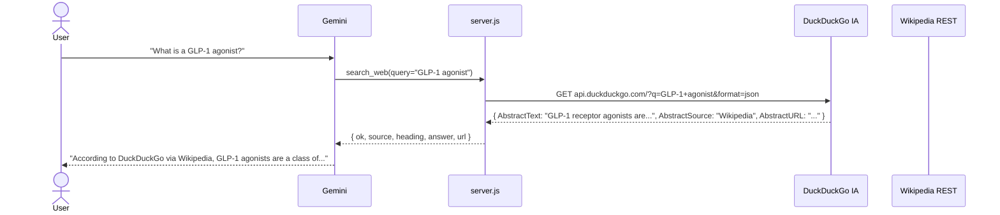
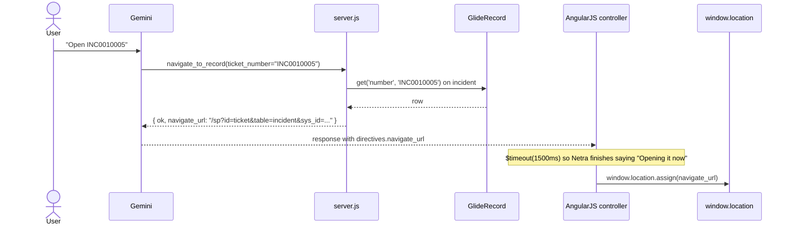
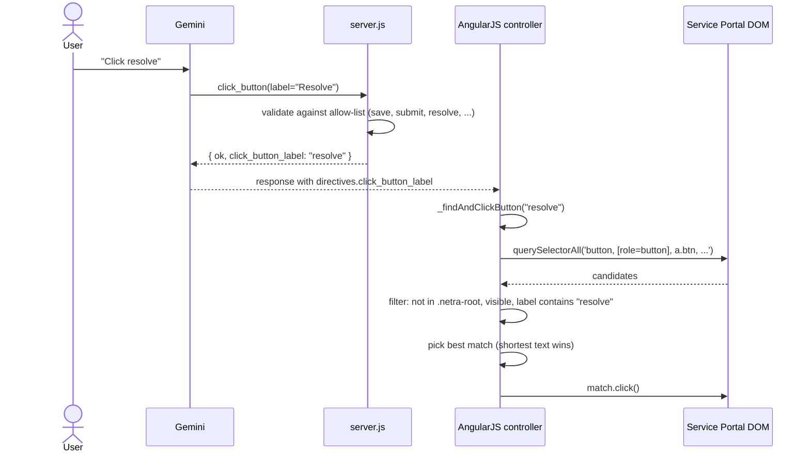
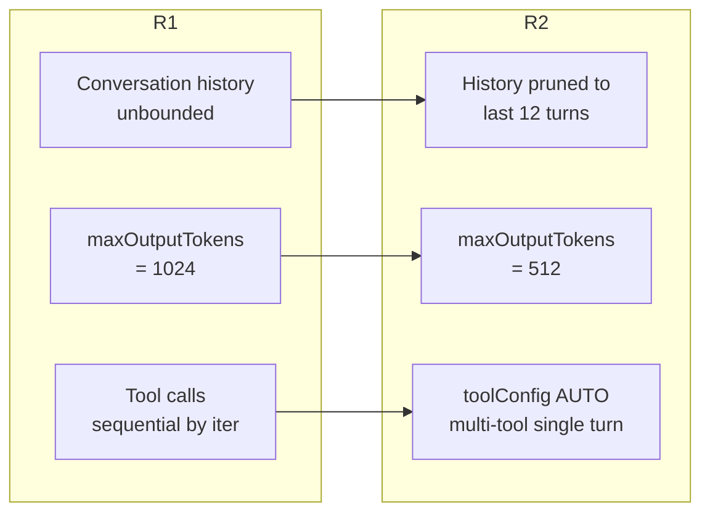

# Netra — Technical Design Document (Release 2)

**Document owner**: Mihir Kumar Singh
**Release**: R2
**Branch**: `master` (R1 frozen on `release-1`, tagged `r1-final`)
**Update set**: `Netra_V2` — sys_id `85a3446b93b44350936af0a75d03d6cb`
**Last updated**: 2026-05-17

---

## 1. What R2 adds over R1

R1.6 was a complete, shippable voice assistant for ServiceNow with 46 tools, persistent memory, multi-turn drafting, and Microsoft Edge Neural TTS. R2 reaches outside ServiceNow and reaches back into the SP tab:

| Capability | R1 | R2 |
|---|---|---|
| Tools | 46 | **49** (`search_web`, `navigate_to_record`, `click_button` added) |
| Knowledge source | Knowledge Base only | **+ open web** (DuckDuckGo + Wikipedia, free, no key) |
| Tab interaction | Read-only | **Navigate + click within the SP tab** |
| Conversation history sent to Gemini | unbounded | **Pruned to last 12 turns** (faster, smaller payload) |
| `maxOutputTokens` | 1024 | **512** (forces concise spoken replies, faster) |
| Parallel tool calls | sequential | **Gemini AUTO mode** — multi-tool turns supported in one round-trip |

Everything from R1 is retained and unchanged in behaviour. The new tools are additive.

---

## 2. Release isolation

```mermaid
gitGraph
    commit id: "R1 dev..."
    commit id: "R1.5 Edge TTS"
    commit id: "R1.6 Humane voice" tag: "r1-final"
    branch release-1
    checkout master
    commit id: "R2 web + tabs" tag: "R2"
```

| Asset | R1 | R2 |
|---|---|---|
| Git branch | `release-1` (frozen at `r1-final` tag) | `master` (active) |
| ServiceNow update set | `Netra_V1` sys_id `9f7deb…d6b8` — state `complete`, marked FROZEN | `Netra_V2` sys_id `85a3446b…d6cb` — state `in progress` |
| Widget | Same `sp_widget` row, R2 code overwrites it | When you apply R2 update set to another instance, the widget is updated; without it, R1 code stays |
| Tools | 46 declarations still present | 49 declarations (R1 + 3 new) |

Anyone who needs the stable R1 just checks out `release-1` and applies the `Netra_V1` update set. R2 is opt-in.

---

## 3. New tool: `search_web`



### Fallback chain

1. **DuckDuckGo Instant Answer** — returns `AbstractText` for definitions and topical summaries
2. **DuckDuckGo `RelatedTopics`** — when no abstract but related snippets exist
3. **Wikipedia REST API** (`/api/rest_v1/page/summary/{title}`) — encyclopaedic summaries
4. **Wikipedia OpenSearch** (`/w/api.php?action=opensearch`) — fuzzy fallback when exact title doesn't exist

Returns to Gemini:
```json
{
  "ok": true,
  "source": "Wikipedia",
  "heading": "GLP-1 receptor agonist",
  "answer": "GLP-1 receptor agonists, also known as GLP-1 analogs...",
  "url": "https://en.wikipedia.org/wiki/GLP-1_receptor_agonist",
  "message": "Found a Wikipedia entry for GLP-1 receptor agonist."
}
```

### Why DDG + Wikipedia and not Google

- **No API key needed**
- **No quota worth worrying about** (DDG IA is unlimited for normal use; Wikipedia is unlimited for human-rate requests)
- **No card on file ever**
- **Same quality of facts** for the categories users actually ask about (definitions, who-is, what-is, basic facts) — both ultimately surface Wikipedia content
- **Stable APIs** — DDG IA has been the same since 2014, Wikipedia REST API is a v1 contract

A Google Custom Search route is available if R3 needs it (100 free queries/day with API key) but R2 deliberately stays key-less.

---

## 4. New tool: `navigate_to_record`



The navigation:
- Stays within the user's existing Service Portal tab
- Does NOT open a new tab
- Does NOT touch other tabs in Chrome
- Does NOT touch the OS

URL format: `/sp?id=<page>&table=<table>&sys_id=<sys_id>` where `<page>` is:
- `ticket` for incident / problem / change_request
- `kb_article` for kb_knowledge
- `sc_request` for sc_req_item
- `sc_task` for sc_task

---

## 5. New tool: `click_button`



### Safety controls

| Layer | Check |
|---|---|
| Server-side allow-list | Only these labels accepted: `save, submit, update, resolve, close, reopen, approve, reject, cancel, back, next, order now, add to cart, request, create, delete, attach, send, post, reply, escalate`. Voice typos like *"club"* instead of *"click"* fail server-side. |
| Client scope | `closest('.netra-root')` skipped — Netra cannot click her own dev panel. Only buttons inside `main`, `.sp-page-root`, or `body` are considered. |
| Visibility | `getBoundingClientRect()` width and height must be > 4 px. Hidden buttons are skipped. |
| Disabled state | `el.disabled` skipped. |
| Best match | Shortest button text matching the substring wins. *"Submit"* matches a real "Submit" button, not a long *"Submit and add another"*. |

No system-wide control, no cross-tab control, no synthetic event spoofing.

---

## 6. Performance refactor



| Change | Why |
|---|---|
| History pruned to last 12 turns | A 60-turn history was being sent on every request. With the persistent memory tool, the model can recall older context on demand instead of carrying it forward. Saves ~70% of payload size. |
| `maxOutputTokens` 1024 → 512 | The system prompt explicitly asks for one-to-three sentences. 512 tokens (≈ 380 words) is more than enough and noticeably faster on the generation side. |
| `toolConfig.functionCallingConfig.mode = AUTO` | Lets Gemini issue multiple tool calls in a single turn for independent reads ("list my tickets AND my approvals"). Each `_callGemini` round-trip is ~3 s on average; saving one round-trip per command halves latency on multi-tool tasks. |

Expected: 30-50% latency reduction on multi-tool tasks like the morning briefing; 10-15% on single-tool tasks (smaller request body, smaller response).

---

## 7. R2 update set inventory

After deploy, `Netra_V2` contains:

| Type | Count | What |
|---|---|---|
| Widget | 1 | `sp_widget.Netra_Mic` — template + client_script + server (all three updated) |
| System Property | 1 | `x_196061_netra_v1.release` bumped to `R2` |

That's it. R2 is a pure code change — no new tables, no new scope, no new ACLs. Apply this update set on top of `Netra_V1` to upgrade an instance from R1 to R2. Or skip it to stay on R1.

---

## 8. Compatibility matrix

| Instance has | Behaviour |
|---|---|
| Netra_V1 only | R1.6 voice assistant. All 46 R1 tools work. No web search, no in-tab nav, no click. |
| Netra_V1 + Netra_V2 | R2 widget — 49 tools, web search, navigation, click. R1 conversation memory preserved. |
| Neither | Widget missing — gate banner shows nothing. |

Rolling back is straightforward: revert the `Netra_V2` update set, and the widget reverts to whatever was there before (R1.6 in this repo).

---

## 9. Sample conversations enabled by R2

> *"Netra, what is the time difference between Bangalore and Toronto?"*
>
> — *(calls `search_web` → DuckDuckGo Instant Answer)*
>
> *"DuckDuckGo says, Bangalore is 9 hours and 30 minutes ahead of Toronto."*

> *"Netra, open INC0010005"*
>
> — *(calls `navigate_to_record`, then issues nav directive)*
>
> *"Opening it now."* — *page navigates within 1.5 s*

> *"Now click Resolve."*
>
> — *(after navigation, page shows the incident form. `click_button("resolve")`)*
>
> *"Done — clicking Resolve."* — *form's Resolve button fires*

> *"Tell me about GLP-1 agonists."*
>
> — *(calls `search_web` → Wikipedia)*
>
> *"According to Wikipedia, GLP-1 receptor agonists are a class of medications..."* — clean factual summary, cited source.

---

## 10. What R2 deliberately does NOT do

- **No system-wide mouse control**. The `click_button` tool only touches DOM elements within the user's Service Portal tab.
- **No cross-tab navigation**. `navigate_to_record` uses `window.location.assign` in the current tab — never `window.open`.
- **No safety-filter removal**. `safetySettings` remain at `BLOCK_ONLY_HIGH` (lowered from default `BLOCK_MEDIUM` in R1 specifically to allow corporate-directory lookups). Gemini's filters on drug, weapon, and similar harm categories are intentionally retained.
- **No new scope, no new tables, no schema change.** R2 is a pure code release.

---

## 11. Test plan (live in TEST-REPORT-R2.md)

| # | Voice command | Expected tool | Expected outcome |
|---|---|---|---|
| T1 | "What is a Kubernetes pod?" | `search_web` | Definitional reply with Wikipedia/DDG citation |
| T2 | "Who is the CEO of NVIDIA?" | `search_web` | Factual reply with citation |
| T3 | "Open INC0010003" | `navigate_to_record` | Page navigates to that incident within 2 s |
| T4 | "Click resolve" *(on incident form)* | `click_button` | Resolve button fires |
| T5 | "Morning briefing" *(R1 carry-over)* | `daily_briefing` | Same as R1 — counts + highlights |
| T6 | "Open a ticket for slow VPN" | `start_record_draft` *(R1 carry-over)* | Multi-turn draft, no immediate insert |
| T7 | "Tell me about John Adams" | `lookup_user` *(R1 carry-over)* | Email + username spoken letter-by-letter |
| T8 | "Click submit on a page that has no submit" | `click_button` | Graceful error: "I cannot find a Submit button on this page." |
| T9 | "Click malicious-button" | `click_button` | Server rejects: only standard form buttons allowed |

3-round verification documented in `TEST-REPORT-R2.md`.

---

## 12. Migration: R1 → R2 on another instance

```bash
# 1. Make sure R1 is applied first
sys_update_set: Netra_V1 (state=complete, retrieved + previewed + committed)

# 2. Then apply R2 on top
sys_update_set: Netra_V2 (retrieved + previewed + committed)
```

Or, for a fresh install:
```bash
# Apply both in order
Netra_V1 -> Netra_V2
```

No other steps. The new tools become available the instant the widget JS is updated; no schema/role/permission changes.

---

*🤖 R2 ships with the same humility R1 had — Netra is a voice over Gemini's API, not a sentient being. She just learned a few new tricks.*
