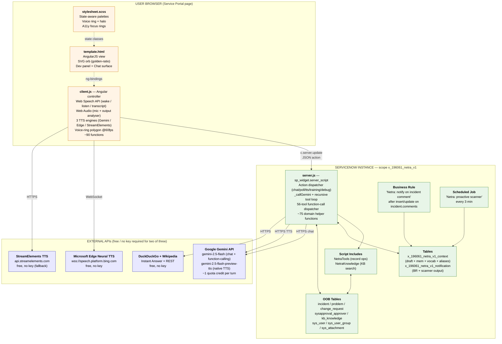
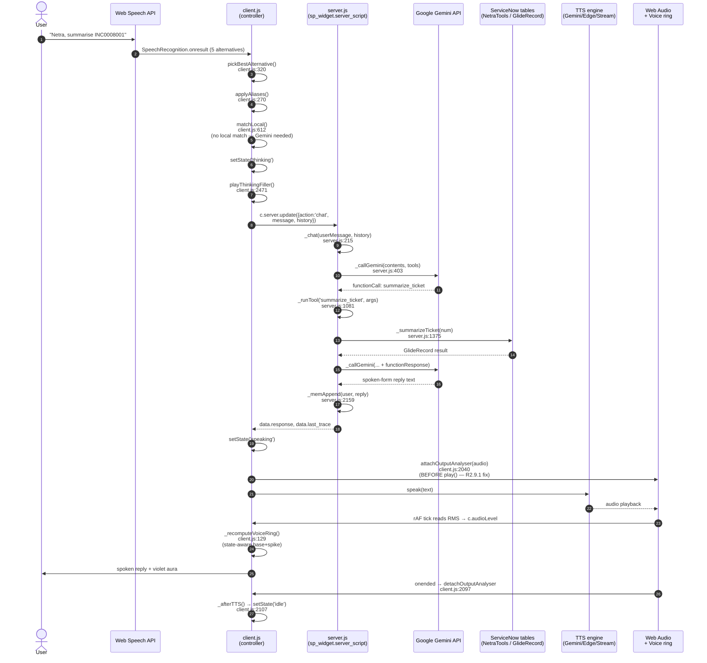
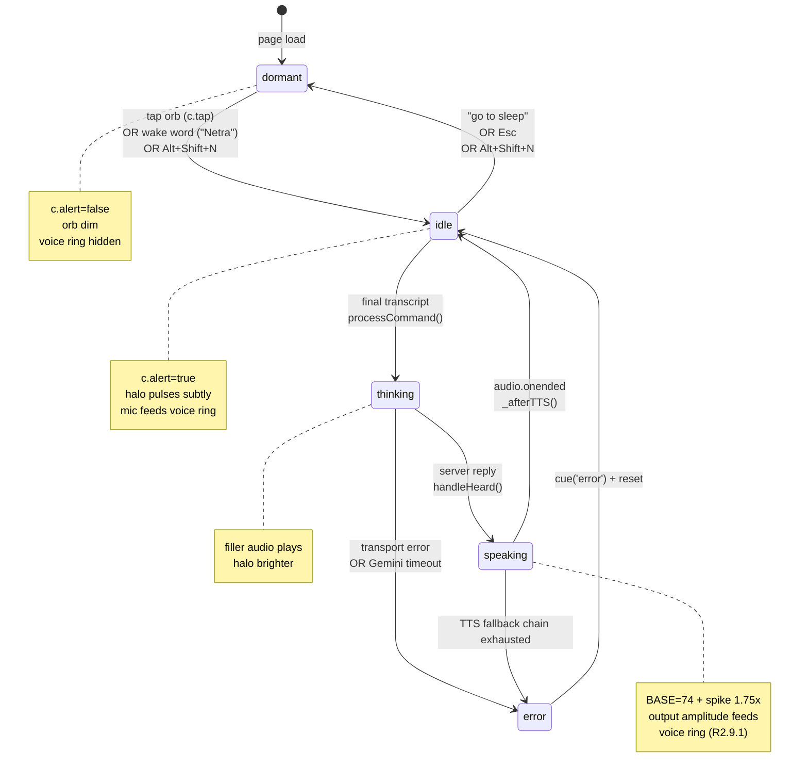
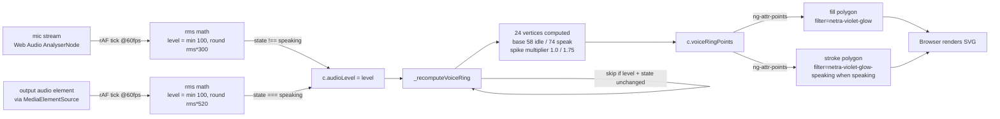
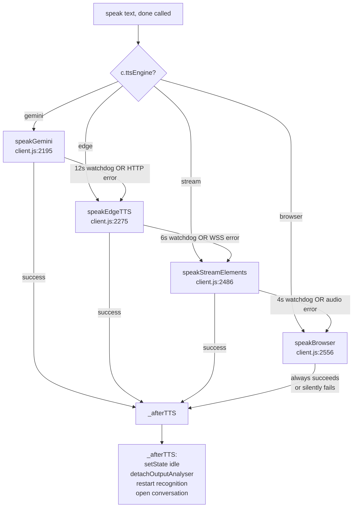
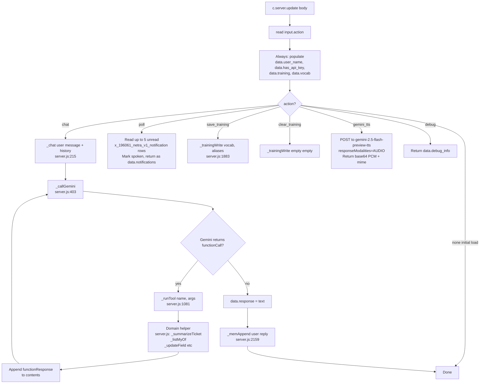
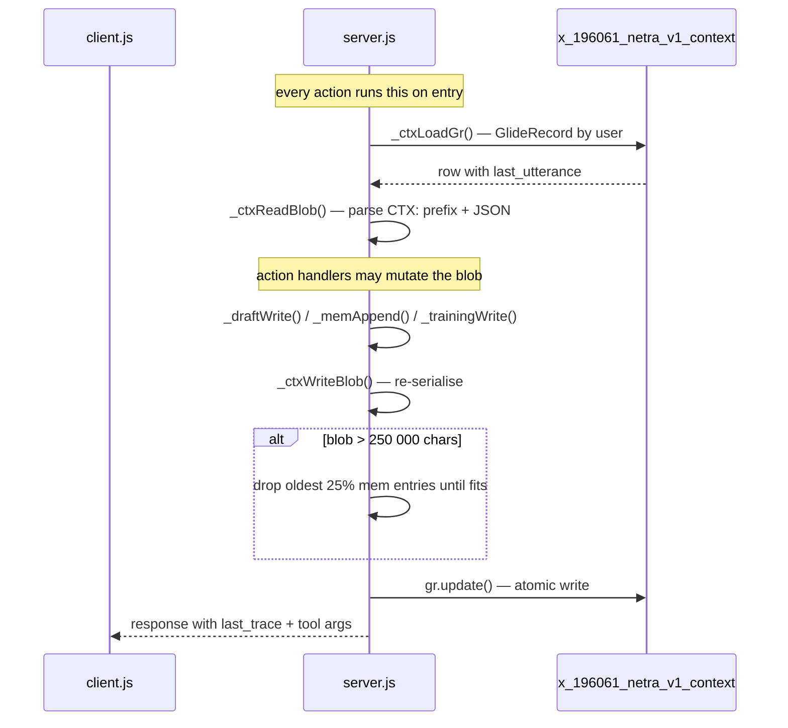

# Netra — Technical Design Document

**Version**: R2.9.1 (NetraDeploymentV1)
**Last updated**: 2026-05-18
**Audience**: ServiceNow architects, accessibility engineers, future maintainers

This document is the authoritative reference for every script in the Netra widget. It explains *what every file does, every function does, every tool does, every CSS layer does, and how all of it fits together*. Read it cold and you should be able to maintain or extend the system without reading the code first.

Every code reference is given as `<filename>:<line>` — those line numbers correspond to the source files in `netra-snow/source/widget/` at this build.

---

## 0. One-page mental model

**Netra** is a single ServiceNow Service Portal widget (`Netra Mic`, table `sp_widget`, id `netra-mic`, sys_id `f6a50e9793b40350936af0a75d03d61c`) that ships with **four source files** plus a small constellation of supporting records (one Business Rule, two Script Includes, one Scheduled Job, two custom tables, two system properties, cross-scope privileges, ~12 sp_instance placements, one classic-UI application menu).

### 0.1 Overall architecture



### 0.2 Voice command lifecycle



### 0.3 Orb state machine



### 0.4 Unified Netra Context blob (per-user state)

```mermaid
classDiagram
    class x_196061_netra_v1_context {
        +string user (ref sys_user)
        +string last_utterance (max 250 000)
        +datetime sys_updated_on
    }
    class CTXBlob {
        +Draft draft
        +MemEntry[] mem (cap 100)
        +VocabMap vocab
        +AliasMap aliases
    }
    class Draft {
        +string record_type
        +Map fields
        +datetime created_at
    }
    class MemEntry {
        +string t (timestamp)
        +string u (user msg, max 240 char)
        +string n (Netra reply, max 480 char)
    }
    class VocabMap {
        +Map[word, {count, lastSeen}]
    }
    class AliasMap {
        +Map[mishearLower, intendedString]
    }
    x_196061_netra_v1_context "1" *-- "1" CTXBlob : last_utterance = "CTX:" + JSON
    CTXBlob "1" *-- "0..1" Draft
    CTXBlob "1" *-- "0..100" MemEntry
    CTXBlob "1" *-- "1" VocabMap
    CTXBlob "1" *-- "1" AliasMap
```

The widget never carries domain logic — it's an AngularJS shell. **All ServiceNow operations happen server-side**, in the scoped app `x_196061_netra_v1`, under the calling user's permissions.

---

## 1. Scoped application

| Property | Value |
|---|---|
| Application name | `Netra V2 Update` |
| Scope | `x_196061_netra_v1` |
| Scope sys_id | `cbb86f0f93b0cf10936af0a75d03d662` |
| Tables created | `x_196061_netra_v1_context` (per-user draft + memory + training), `x_196061_netra_v1_notification` (BR + scanner output) |
| Cross-scope privileges | read+write on `incident`, `problem`, `change_request`, `sc_request`, `sc_req_item`, `sc_task`, `kb_knowledge`, `sysapproval_approver`, `sys_user`, `sys_user_group`, `sys_attachment`, `sys_email`, `sys_user_preference`, plus read on all `sys_script_*` tables (for `read_script` / `list_scripts`) |
| System properties | `x_196061_netra_v1.gemini_api_key` (string, encrypted), `x_196061_netra_v1.gemini_model` (string, default `gemini-2.5-flash`) |

---

## 2. File inventory

| File | Lines | Role |
|---|---:|---|
| `source/widget/template.html` | 502 | AngularJS markup: SVG orb (golden-ratio geometry), 2 voice-ring polygons, 2 SVG filters for the violet glow, dev panel, chat surface, ARIA roles |
| `source/widget/client.js` | 2993 | AngularJS controller: speech recognition, audio analysis, TTS, voice ring, dev tools, ~90 functions |
| `source/widget/server.js` | 2858 | Server-side scoped-app script: Gemini API client + 56-tool dispatcher + Context I/O, ~75 helpers |
| `source/widget/stylesheet.scss` | 1139 | Visual styling: orb geometry, voice-ring, dev panel, accessibility-first contrast, ~12 state-specific palettes |

### 2.1 Code-reference index (every concept → file:line)

| Concept | Reference |
|---|---|
| Wake-word matcher | `client.js:562` `isWakeWord()`, `client.js:576` `matchesWake()` |
| Sleep matcher | `client.js:597` `matchSleep()` |
| Local intent shortcuts | `client.js:612` `matchLocal()` — 18+ intents (greetings, smalltalk, repeat, where am I, quiet, faster/slower, praise) |
| Spoken-number normaliser | `client.js:725` `normalizeNumbers()` |
| Mic-level meter + health watchdog | `client.js:859` `startMicLevelMeter()` |
| Voice-ring polygon recompute | `client.js:129` `_recomputeVoiceRing()` (state-aware base+spike) |
| Output amplitude analyser hook | `client.js:2040` `attachOutputAnalyser()` (attached BEFORE play, R2.9.1) |
| Output analyser cleanup | `client.js:2097` `detachOutputAnalyser()` |
| SpeechRecognition lifecycle | `client.js:1373` `startContinuous()` + `client.js:1500` `startListeningWatchdog()` |
| Top-5 alternative rerank | `client.js:302` `_scoreAlternative()` + `client.js:320` `pickBestAlternative()` |
| Speech grammar (JSGF) | `client.js:1606` `attachGrammar()` — includes dynamic `<common>` rule with COMMON_VOCAB |
| Process final transcript | `client.js:1687` `processFinalTranscript()` |
| Send chat to server | `client.js:1800` `processCommand()` |
| Handle server reply | `client.js:1846` `handleHeard()` |
| TTS routing | `client.js:1978` `speak()` |
| Gemini-native TTS | `client.js:2195` `speakGemini()` (PCM → WAV via `_pcmToWavBlob()` at `:2167`) |
| Edge Neural TTS | `client.js:2275` `speakEdgeTTS()` (WSS handshake at `:2147` `_edgeConnectId()`) |
| StreamElements TTS | `client.js:2486` `speakStreamElements()` |
| Browser TTS fallback | `client.js:2556` `speakBrowser()` |
| Thinking-cue fillers | `client.js:2454` `preloadFillers()` + `client.js:2471` `playThinkingFiller()` (18 phrases) |
| Post-TTS state reset | `client.js:2107` `_afterTTS()` |
| Hotkey bindings | `client.js:2732` `bindHotkeys()` (Alt+Shift+N/D/R, Space, Esc) |
| Notification poll loop | `client.js:2782` `startNotificationPolling()` (every 4s) |
| Orb drag-and-drop | `client.js:1158` `c.dragStart()` |
| State setter | `client.js:2982` `setState()` |
| **Server action dispatch** | `server.js:60` (chat / poll / save_training / clear_training / gemini_tts / debug) |
| Gemini chat loop with tool calls | `server.js:215` `_chat()` |
| Gemini model fallback chain | `server.js:403` `_callGemini()` |
| One-shot Gemini REST call | `server.js:458` `_callGeminiOnce()` |
| System prompt | `server.js:508` `_systemPrompt()` |
| Tool declarations (all 56) | `server.js:690` `_toolDeclarations()` |
| Tool dispatcher | `server.js:1081` `_runTool()` |
| Context blob I/O | `server.js:1823` `_ctxLoadGr()`, `:1833` `_ctxReadBlob()`, `:1856` `_ctxWriteBlob()` (safety truncate at 250 KB) |
| Memory append/recall | `server.js:2159` `_memAppend()` (MEM_CAP=100), `:2171` `_recallPastConversations()` |
| Remember fact | `server.js:2198` `_rememberFact()` |
| Draft record flow | `server.js:1900` `_startRecordDraft`, `:1919` `_setRecordField`, `:1939` `_reviewDraft`, `:1959` `_confirmAndCreate`, `:1986` `_cancelDraft` |
| Sidebar Discussion (with live_message fallback) | `server.js:1998` `_sendSidebarMessage()` |
| Web search (DuckDuckGo + Wikipedia) | `server.js:2227` `_searchWeb()` |
| Update arbitrary field | `server.js:2392` `_updateField()` (with inlined UPDATE_ALLOW + FIELD_SYNONYM) |
| Read script source | `server.js:2515` `_readScript()` (9 code tables), `:2580` `_formatScript()`, `:2619` `_formatWidget()` |
| List scripts | `server.js:2637` `_listScripts()` |
| Vocab cache (6h) + COMMON_VOCAB | `server.js:2729` `_getVocab()` |
| Pause-state preference | `server.js:2825` `_ensurePref()`, `:2842` `_setPauseState()` |
| Voice-ring SVG filters | `template.html:316-353` `<filter id="netra-violet-glow">` + `<filter id="netra-violet-glow-speaking">` |
| Voice-ring polygons | `template.html:355-372` `.netra-voice-ring-fill` + `.netra-voice-ring-stroke` with `ng-attr-filter` |
| Voice-ring gradient stops | `template.html:265-288` (radial fill + linear stroke gradients) |

---

## 3. The data round-trip protocol

Every meaningful interaction between client and server goes through `c.server.update()`, an AngularJS-shaped POST that submits the `c.data` object server-side, runs `server.js`, and returns the mutated `data` object back to the client.

`server.js` reads the action verb from `input.action` and dispatches:

| `input.action` | Server reads | Server writes (into `data`) |
|---|---|---|
| `chat` | `input.message`, `input.history`, optional `input.image_b64` | `data.response`, `data.last_trace`, `data.last_tool_args`, `data.force_history_reset` (rare) |
| `poll` | (nothing) | `data.notifications` (array of pending notification rows, then marks them spoken) |
| `save_training` | `input.vocab`, `input.aliases` | `data.training_result.{ok, vocab_count, aliases_count}` |
| `clear_training` | (nothing) | `data.training_result` |
| `gemini_tts` | `input.text`, `input.voice` | `data.gemini_tts.{ok, b64, mime, voice}` |
| `debug` | (nothing) | `data.debug_info` (instance, scope, version, etc.) |
| _initial load_ | (nothing; ServicePortal fires server.js on render) | `data.user_name`, `data.user_sys_id`, `data.has_api_key`, `data.paused`, `data.training`, `data.vocab` |

The "initial load" branch always runs, before any action branch — so `data` always carries the user identity and training data even when the page just rendered.

---

## 4. The unified Netra Context model

Per-user state lives in **one** row of `x_196061_netra_v1_context`, keyed by `user_sys_id`. The `last_utterance` column (max_length 32000) is treated as a JSON blob with this shape:

```json
{
  "draft": {
    "active": true,
    "table": "incident",
    "fields": { "short_description": "vpn broken", "urgency": "2" },
    "started_at": "2026-05-18 04:12:00"
  },
  "mem": [
    { "ts": "...", "user": "...", "netra": "..." },
    ...max 30 most recent exchanges
  ],
  "facts": [
    { "ts": "...", "fact": "User prefers high-contrast UI" }
  ],
  "vocab":   { "vpn": { "count": 12, "lastSeen": "..." }, ... },
  "aliases": { "net rah": "Netra", "agar": "Adam" },
  "watchlist": ["INC0008001", "CHG0030005"],
  "focus":    { "number": "INC0008001", "table": "incident", "ts": "..." }
}
```

**Why one blob and not seven columns?** Atomic writes — one `gr.update()` saves everything; no risk of half-committed multi-row state. Cheap to load (one GR.get) and trivial to back up.

The server reads this with `_ctxLoadGr()` → `_ctxReadBlob()` and writes with `_ctxWriteBlob()`. Domain operations (`_draftRead`, `_draftWrite`, `_memAppend`, `_trainingRead`, `_trainingWrite`) are thin facades over the blob.

---

## 5. template.html — section by section

The orb's viewBox is fixed at **120 × 120**. Every geometry constant in the SVG and CSS is in units of this viewBox so the orb scales pixel-perfect at any rendered size.

| Section | Lines (approx) | What it does |
|---|---|---|
| `<div class="netra-orb">` wrapper | 1–40 | Outer positioning host; `ng-class` exposes state to CSS (`netra-state-dormant`, `idle`, `thinking`, `speaking`, `shrunk`, `dragging`). `tabindex=0` for keyboard focus, `aria-label` describing the orb. |
| Dev panel | ~40–250 | `ng-show="c.dev"`. Sections: TTS engine cycler, voice picker, mic test, screenshot capture, log tail, charts (confidence + latency), training (vocab + aliases), nuclear reset. |
| Inline `<style>` for dev fade-in | one block | Allows the dev panel to fade in without depending on global CSS load order. |
| SVG `<defs>` | ~260–300 | Reusable gradients: `netra-halo` (outer glow), `netra-voice-gradient` (radial fill — violet→magenta→amber, case-hardened patina), `netra-voice-stroke-gradient` (linear multi-tone for the stroke), `netra-rim` (lower-right rim light), `netra-inner-shadow` (inset cast shadow), `netra-drop` (soft drop-shadow filter). |
| Voice-ring polygons | ~305–325 | Two `<polygon>` elements driven by `c.voiceRingPoints` (24 vertices x,y…). One is the filled translucent waveform; one is the stroked outline. `ng-show="c.alert"` keeps them hidden when Netra is dormant. |
| Halo, sphere, iris layers | ~327–410 | Golden-ratio circles: sphere radius 50, limbal r ≈ 50/φ, iris r ≈ 50/φ², pupil r ≈ 50/φ³. Two catchlights at the golden-section coords (45.92, 47.10) and (74.08, 72.90). Pentagram inscribed in the iris rotates 21 s/turn. |
| Eyelids | ~412–430 | `<path>`s clipped by the sphere; `transform` animates closed↔open on `c.blinking`. |
| Drop shadow / final filter | ~430–451 | Wrapper for the SVG drop shadow at offset `12/φ = 7.4 px`. |

### Bindings the template depends on

| Scope variable | Driven by | Purpose |
|---|---|---|
| `c.state` | `setState()` in client.js | Top-level mode class on the orb |
| `c.alert` | derived in client.js | Whether the orb is "awake" (idle / thinking / speaking) |
| `c.voiceRingPoints` | `_recomputeVoiceRing()` | The 24 vertex coords for both polygons |
| `c.dev` | `c.toggleDev()` (`Alt+Shift+D`) | Show/hide dev panel |
| `c.log`, `c.charts.*`, `c.micLevel` | telemetry helpers | Dev panel data |
| `c.conversationOpen` | `openConversation()`, `closeConversation()` | Whether the chat surface is rendered |
| `c.aliasList`, `c.personalVocab`, `c.vocabCount`, `c.aliasCount` | training helpers | Training UI |
| `c.pendingOpenUrl` | `_runOpenUrl` callback path | Popup-blocker fallback button |

---

## 6. stylesheet.scss — layers

Single-file SCSS, ~1146 lines. Layers (from outermost to innermost in z-order):

1. **`.netra-orb` host** (lines 1–80): fixed-position 72×72 box. Hover scales 1.0618× (1 + 1/φ × 0.1). CSS variables hold the colour palette so it can be themed by state.
2. **State classes** (lines 80–250): `.netra-state-dormant`, `-idle`, `-thinking`, `-speaking`, `-shrunk`, `-dragging`. Each overrides `--iris-bright`, `--iris-mid`, `--core-mid`, halo opacity, and may add a state-specific animation.
3. **Voice ring** (lines 120–160): the two polygon classes plus the speaking-state aura. Filter chain on the stroke gives the violet → magenta → amber case-hardened glow. The halo's `halo-pulse-speaking` keyframe scales 1.32×–1.52× while speaking.
4. **Pentagram + iris** (lines 165–210): pentagram rotation animation (21 s/turn), iris transitions, pupil breath cycle (3.618 s — φ²).
5. **Catchlights, eyelids, glints** (lines 210–360): all geometry positioned at golden-section coords.
6. **State-specific palettes** (lines 210–355): each state has an `--iris-bright` set to a distinct hue so the orb reads emotionally (warm idle, soft thinking, vibrant speaking, dim dormant).
7. **Dev panel** (lines 360–650): dark glass panel, sticky-positioned to the right of the orb; charts use 60×24 SVG miniatures; mic-level bar fills horizontally with a colour gradient.
8. **Chat surface** (lines 650–820): full-screen overlay (when `c.conversationOpen`) with last-turn transcript and Netra's reply. Honours `prefers-reduced-motion`.
9. **Accessibility helpers** (lines 820–950): focus rings (3 px outline, 2 px offset, high-contrast), `:focus-visible` only, ARIA live region styling.
10. **Drop-shadow / final visual polish** (lines 950–1146): subtle vignette, drop-shadow tuning, print stylesheet (`@media print { .netra-orb { display: none; } }`).

---

## 7. client.js — function catalogue

The controller is a single ~2932-line function passed to `api.controller`. AngularJS injects `$scope`, `$timeout`, `$window`. The scope alias `c` is `$scope.c` and is what the template binds against.

### 7.1 Boot phase (lines 1–470)

| Function / variable | Lines | Purpose |
|---|---|---|
| Top-of-file scope init | 1–105 | Sets `c.version`, `c.state = 'dormant'`, default flags (`c.dev`, `c.alert`, `c.conversationOpen`), Web-Speech-API availability check, default voice config, screenshot pendings. |
| Voice ring constants | 109–123 | 24-element `VOICE_RING_MULTIPLIERS`, base radius 58, precomputed `VOICE_RING_SIN`/`COS` arrays, `_lastVoiceRingLevel` change-detection cache. |
| `_recomputeVoiceRing()` | 124–137 | Rebuilds `c.voiceRingPoints` whenever `c.audioLevel` changes. Skips work if level unchanged (cheap guard for the 60 fps rAF loop). |
| `loadTrainingData()` | 166–209 | Reads `c.data.training` (filled by server initial-load), migrates legacy R2.2 localStorage if present, populates `c.personalVocab` + `c.aliases`. |
| `saveTrainingData()` | 212–242 | Debounced 2.5 s; snapshots vocab+aliases, fires `c.server.update({action:'save_training'})`. Guard `_saveInflight` prevents overlap. |
| `_refreshTrainingViews()` | 247–256 | Recomputes `c.aliasList`, `c.vocabCount`, `c.aliasCount` for the dev panel. |
| `applyAliases(text)` | 259–271 | Word-boundary replace using `c.aliases` ("net rah" → "Netra"). |
| `learnFromTranscript(t)` | 275–288 | Bumps `c.personalVocab[word].count` for every word in a successful command. |
| `_scoreAlternative(t, c)` | 291–306 | Reranks top-5 SpeechRecognition alternatives by vocab overlap. |
| `pickBestAlternative(alt)` | 309–323 | Picks the highest-scoring alt + applies aliases. |
| `c.addTrainingWord`, `c.addAlias`, `c.clearTraining` | 326–381 | Dev-panel handlers. |

### 7.2 Telemetry (lines 383–478)

| Function | Lines | Purpose |
|---|---|---|
| `_statsTick()` | 383–391 | Periodic refresh of `c.charts.toolCalls` count. |
| `_seriesToPath(series, scale)` | 393–402 | Builds an SVG `<path d>` string from a numeric array for the dev-panel mini-charts. |
| `_pushConfidence(c)` | 404–413 | Appends to `c.charts.confSeries`, recomputes min/max/last for the dev panel. |
| `_pushLatency(ms)` | 415–427 | Same for latency. |
| `_countTool(name)` | 429–470 | Increments per-tool call counter; drives the heat-map breakdown in the dev panel. |

### 7.3 Conversation surface (lines 482–530)

| Function | Lines | Purpose |
|---|---|---|
| `openConversation(reason)` | 482–488 | Sets `c.conversationOpen = true` (renders chat overlay). |
| `closeConversation()` | 489–495 | Hides the overlay. |

### 7.4 Wake-word and intent matching (lines 532–730)

| Function | Lines | Purpose |
|---|---|---|
| `levenshtein(a, b)` | 532–550 | Edit-distance for fuzzy wake matching. |
| `isWakeWord(w)` / `matchesWake(text)` | 551–584 | Recognises "Netra" with up to 2 edits (handles "net rah", "metra", etc.). |
| `matchSleep(s)` / `matchExplicitWakeUp(s)` | 586–600 | Recognises "go to sleep", "stop listening" / "wake up", "are you there". |
| `matchLocal(s)` | 601–685 | Cheap local intent shortcuts that don't need Gemini: "yes"/"no" continuations, simple greetings, "thank you", "repeat that". |
| `normalizeNumbers(s)` | 686–730 | Converts spoken digit words ("zero one zero zero eight zero zero one") to compact form ("INC0008001"). |

### 7.5 Logging + permissions + mic (lines 731–921)

| Function | Lines | Purpose |
|---|---|---|
| `logEvent(level, msg)` | 731–778 | Appends to `c.log` with timestamp; trims to 100 entries; mirrors to `console.log` when dev panel open. |
| `checkMicPermission()` | 779–819 | Uses `navigator.permissions.query({name:'microphone'})`; sets `c.permission`. |
| `startMicLevelMeter()` | 820–897 | Acquires `getUserMedia({audio: {autoGainControl: false}})`, creates `_micCtx` (one AudioContext), wires `MediaStreamSource → AnalyserNode`. Starts rAF loop that writes `c.micLevel` and drives `c.audioLevel` (and the voice ring) when not speaking. Includes the 20-second health watchdog that resumes a suspended AudioContext and reacquires the mic if tracks die. |
| `stopMicLevelMeter()` | 899–921 | Tears down the rAF, disconnects nodes, releases the stream. |

### 7.6 In-tab DOM operations + screenshots (lines 922–1093)

| Function | Lines | Purpose |
|---|---|---|
| `_findAndClickButton(labelSub)` | 922–972 | Scans the current ServicePortal page DOM for a button whose visible text or `aria-label` contains the given substring (case-insensitive). Clicks and returns the matched label. |
| `c.devCaptureScreen` | 973–1002 | Uses `html2canvas` (loaded on-demand) to grab a base64 PNG of the visible viewport for `analyze_screenshot`. |
| `c.devTestMic` | 1003–1040 | One-shot SpeechRecognition cycle for diagnosing the mic without the wake-word flow. |
| `c.tap` | 1041–1093 | Click handler on the orb. Walks the state machine: dormant → idle (start recognition), idle → dormant (sleep), shrunk → idle (unshrink). |

### 7.7 Orb drag-and-drop (lines 1094–1268)

| Function | Lines | Purpose |
|---|---|---|
| `_applyOrbPosition()`, `_saveOrbPosition()` | 1094–1118 | Persist orb x/y in `localStorage.netra.orbPos`. |
| `c.dragStart`, `_onDragMove`, `_onDragEnd` | 1119–1220 | Touch + mouse-aware drag; threshold of 5 px before tap is suppressed; clamps inside the viewport. |
| `c.devDragStart`, `_onDevDragMove`, `_onDevDragEnd` | 1222–1268 | Same for the dev panel. |

### 7.8 Speech recognition lifecycle (lines 1269–1755)

| Function | Lines | Purpose |
|---|---|---|
| `tryBoot(fromTap)` | 1269–1333 | Decides whether to actually start recognition (mic permission, no current TTS, not in dragging state). |
| `startContinuous()` | 1334–1460 | Creates the SpeechRecognition instance, attaches event handlers, manages restarts on `onend` (Chrome auto-stops after ~60 s). Sets `maxAlternatives=5`. |
| `startListeningWatchdog()` | 1461–1520 | Every 8 s, if `recRunning=false` and not in `dormant`/`speaking`, restart recognition. Self-heals after silent failures. |
| `startVisibilityRecovery()` | 1521–1548 | On `document.visibilitychange`, if returning visible, force-restart recognition (Chrome kills mic in hidden tabs). |
| `sanitizeForGrammar(s)`, `compactList(arr, limit)` | 1549–1566 | Helpers for the grammar-hint string. |
| `attachGrammar(rec)` | 1567–1643 | Builds the SpeechGrammarList from `c.personalVocab` keys + ticket-number prefixes. Chrome ignores grammars but Edge respects them. |
| `processFinalTranscript(text, conf)` | 1644–1756 | Top-level dispatcher when SpeechRecognition emits a final result. Filters by `ignoreFinalsUntil`, applies aliases, picks best alternative, branches into wake/sleep/local/server. |
| `processCommand(text, conf)` | 1757–1802 | Builds the `chat` request, increments stats, calls `c.server.update()`. |
| `handleHeard(transcript)` | 1803–1933 | Post-server callback. Reads tool trace, prefetches mic state, kicks TTS, manages multi-step flows (draft, search). |

### 7.9 Text-to-speech (lines 1935–2562)

Three remote engines + one browser fallback. Cycled with the dev panel's "TTS engine" button or `c.devToggleTTS()`.

| Function | Lines | Purpose |
|---|---|---|
| `speak(text, done)` | 1935–1972 | Top-level entry. Picks engine via `c.ttsEngine` and routes. |
| `_buildHumanSSML(text, voice)` | 1973–1996 | Inserts SSML `<break>` tags at sentence ends, commas, and em-dashes for human cadence. Used by Edge TTS. |
| `attachOutputAnalyser(audioEl)` | 1997–2049 | Web Audio source-and-analyser bound to an `<audio>` element; rAF loop reads RMS and drives `c.audioLevel`. Source+analyser cached on the element to satisfy Web Audio's "createMediaElementSource at most once" rule. |
| `detachOutputAnalyser(audioEl)` | 2050–2058 | Disconnects source + analyser when the audio ends. Without this, AudioContext nodes leak across utterances. |
| `_afterTTS(userDone)` | 2060–2098 | Unified post-TTS bookkeeping: reset state, reopen conversation, restart recognition. |
| `_edgeConnectId()` | 2100–2106 | 32-hex random ID for the Edge WSS handshake. |
| `_pcmToWavBlob(b64, sr)` | 2120–2147 | Wraps Gemini's raw PCM16 in a 44-byte WAV header so `<audio>` can play it. |
| `speakGemini(text, done)` | 2148–2224 | Calls `c.server.update({action:'gemini_tts'})` → wraps PCM in WAV → plays via `<audio>` at 1.2× rate. Falls back to Edge on failure. **Lowest latency + matches Gemini's chat voice.** |
| `speakEdgeTTS(text, done)` | 2225–2354 | Opens WebSocket to `wss://speech.platform.bing.com/.../edge/v1` with the Edge hardcoded TrustedClientToken; streams SSML; assembles MP3 chunks; plays at 1.5×. Falls back to StreamElements. |
| `_edgeBlob(text, voice, cb)` | 2355–2394 | Headless variant for the filler-clip preloader. |
| `preloadFillers()` | 2395–2411 | At boot, generates short "Hmm.", "Let me see.", "Okay so.", "Right.", "Mm.", "Ahh." clips and caches their blob URLs. |
| `playThinkingFiller()` | 2412–2425 | When state hits `thinking`, plays one random filler — eliminates dead air during the Gemini round-trip. |
| `speakStreamElements(text, done)` | 2427–2493 | StreamElements REST API (free, no key). Final fallback before `speakBrowser`. |
| `speakBrowser(text, done)` | 2495–2562 | Browser's built-in `SpeechSynthesis` API. Last-resort fallback. |
| `chooseVoice()`, `pickFemaleVoice()`, `populateVoices()` | 2563–2625 | Browser-TTS voice selection: prefers female Indian-English voices, otherwise any female. |
| `unlockAudio()` | 2626–2633 | First-tap workaround for mobile autoplay restrictions; plays a 1-sample silent buffer. |
| `cue(kind)`, `tone(freqs, dur)` | 2634–2670 | Web Audio synthesised cues ("listening", "thinking", "error"). |

### 7.10 Hotkeys, polling, dev panel (lines 2671–2932)

| Function | Lines | Purpose |
|---|---|---|
| `bindHotkeys()` | 2671–2720 | Global keydown listener. `Alt+Shift+N` toggle orb, `Alt+Shift+D` toggle dev panel, `Alt+Shift+R` nuclear reset, `Space` push-to-talk while orb focused, `Esc` close conversation. |
| `startNotificationPolling()` | 2721–2749 | Every 4 s, `c.server.update({action:'poll'})`. Reads `data.notifications`, queues TTS announcements. |
| `c.toggleDev`, `c.devKey`, `c.devSendText`, … (24 dev-* methods) | 2750–2918 | Dev panel interactions: send a text command (bypass mic), force a specific TTS test, manually replay last reply, swap voice, ping the server, diagnose mic/audio/recognition state, etc. |
| `setState(s)` | 2921–2932 | State-machine setter. Updates `c.state`, derived `c.alert`, fires `_setSpeakingCue` / `_setListeningCue` audio cues. |

---

## 8. server.js — function catalogue

The server script is one IIFE that runs on every `c.server.update()` (and once at initial render). It is **scoped-app code**: it runs as `x_196061_netra_v1` and uses the cross-scope privileges declared on the application.

### 8.1 Top-level dispatch (lines 32–214)

After populating `data.user_name`, `data.has_api_key`, `data.training`, `data.vocab`, etc., it branches on `input.action`:

| Action | Lines | What it does |
|---|---|---|
| `chat` | 60–69 | `_chat(input.message, input.history)` → writes `data.response`, `data.last_trace`. |
| `poll` | 70–98 | Reads up to 5 unread `x_196061_netra_v1_notification` rows for the user → marks them spoken → returns them as `data.notifications`. |
| `save_training` | 99–118 | `_trainingWrite(input.vocab, input.aliases)` |
| `clear_training` | 119–125 | `_trainingWrite({}, {})` |
| `gemini_tts` | 126–182 | Calls `models/gemini-2.5-flash-preview-tts:generateContent` with `responseModalities=['AUDIO']` + `voiceConfig.prebuiltVoiceConfig.voiceName = input.voice`. Returns base64 PCM + mime. |
| `debug` | 183–213 | Returns `data.debug_info` with instance URL, scope, version, has_api_key, current notification count. Used by `c.devDiagnose()`. |

### 8.2 Gemini client (lines 215–503)

| Function | Lines | Purpose |
|---|---|---|
| `_chat(userMessage, history)` | 215–402 | The full chat-loop. Builds `contents` from history + the new user message (or an image inlineData if `input.image_b64` is set). Calls `_callGemini` → if the response has a `functionCall`, runs the tool via `_runTool`, appends a `functionResponse`, calls Gemini again — up to 4 nested tool turns before giving up. Sanitises the history on the way back: long tool-response bodies > 1500 chars truncated, inlineData stripped, hard cap of 60 KB on total payload. |
| `_callGemini(apiKey, model, contents, tools, sysInstruction)` | 403–457 | Wrapper around `_callGeminiOnce` with a model fallback chain: `gemini-2.5-flash` → `gemini-2.5-flash-8b` → `gemini-1.5-flash`. If the first model returns 429 or 503, retry on the next. |
| `_callGeminiOnce(apiKey, model, contents, tools, sysInstruction)` | 458–503 | One REST round-trip. Builds the body with safety filters at BLOCK_ONLY_HIGH (this is an internal corporate assistant, not consumer surface), `temperature: 0.7`, `maxOutputTokens: 512` (forces concise replies). 30-second `setHttpTimeout`. |

### 8.3 System prompt (lines 508–688)

`_systemPrompt()` returns a long string that establishes:

- Netra's identity (warm Indian-English voice, professional, briefcaps to ServiceNow context)
- The "always confirm before write" rule for `update_field`
- The "use start_record_draft instead of create_ticket" rule for multi-turn record creation
- The "use update_field for named fields, update_ticket for customer-visible comments" disambiguation
- The "use send_sidebar_message instead of send_message_to_user" rule
- The disclaimer that `analyze_screenshot` is a signal — the client will resend the same turn with `image_b64` populated
- The "never refuse to look up a colleague" rule for `lookup_user`
- The directory of voice-command shortcuts the user may say
- Brevity instructions: under 2 sentences for routine replies, never read back the whole tool output verbatim

### 8.4 Tool catalogue (lines 690–1076)

`_toolDeclarations()` returns the 56 tools below. Each is a Gemini function declaration: `{name, description, parameters}`. They are bundled into a single `functionDeclarations` array.

#### Tickets and records (15 tools)

| Name | Behaviour |
|---|---|
| `create_ticket` | Open a new incident. `short_description` required, `urgency` optional (default 3). Returns the new INC number. *(Superseded by `start_record_draft` for conversational drafting; left in for one-shot creation.)* |
| `list_tickets` | Open incidents where `caller_id = user` AND state != 7 (closed). Max 8 rows. |
| `resolve_ticket` | Sets state=6, close_code='Solved (Work Around)', close_notes from arg. |
| `update_ticket` | Appends to `comments` (customer-visible). Distinct from `add_work_note`. |
| `get_ticket_status` | Reads state, priority, assigned_to, opened_at; formats spoken summary. |
| `change_priority` | Sets `priority` (1–4). Recomputes urgency/impact via system rules. |
| `escalate_ticket` | Decrements `priority` by 1 (3→2→1, capped). |
| `assign_ticket_to_group` | Substring match on `sys_user_group.name`; sets `assignment_group`. |
| `assign_ticket_to_user` | Substring/email match on `sys_user.{name,user_name,email}`; sets `assigned_to`. |
| `list_my_problems` | Open rows on `problem` where assigned_to or opened_by = user. |
| `list_my_changes` | Open rows on `change_request` similar. |
| `list_my_requests` | Open rows on `sc_req_item`. |
| `search_incidents` | LIKE match on `short_description` across all incidents (not just user's). Max 8 rows. |
| `summarize_ticket` | Full read-out: description, state, priority, assignee, last 3 comments, last 2 work notes. |
| `list_overdue` | User's own incidents past SLA window (P1>4 h, P2>1 d, P3+>3 d). |

#### Approvals + workload (4 tools)

| Name | Behaviour |
|---|---|
| `list_approvals` | Rows on `sysapproval_approver` where `approver=user`, `state=requested`. Resolves source record per row. |
| `decide_approval` | Looks up the approval by source `ref_number`, sets state to `approved` or `rejected`. |
| `workload_summary` | Counts: open incidents (mine), open problems, open changes, RITM, pending approvals. |
| `team_workload` | For each group the user belongs to, counts open incidents in that group. |

#### Drafts + multi-turn flow (5 tools)

| Name | Behaviour |
|---|---|
| `start_record_draft` | Begins a draft for `incident` / `problem` / `change_request`. Writes `{draft: {active:true, table, fields:{}}}` into Context blob. Replies with "What's the short description?" etc. |
| `set_record_field` | Updates one field in the draft (`short_description`, `urgency`, `priority`, etc.). Tolerant of spoken forms ("high" → "2"). |
| `review_draft` | Reads back the current draft's fields. |
| `confirm_and_create` | Inserts the record on the appropriate table. Clears the draft. Returns the new number. |
| `cancel_draft` | Clears the draft. |

#### Notifications + pause (2 tools)

| Name | Behaviour |
|---|---|
| `pause_notifications` | Sets `x_196061_netra_v1.user_paused_until` preference for `hours` from now. |
| `resume_notifications` | Clears the preference. |

#### Knowledge + attachments + messaging (5 tools)

| Name | Behaviour |
|---|---|
| `search_knowledge` | LIKE match on `kb_knowledge.short_description` where `workflow_state=published`. Returns top 3 with KB number and title. |
| `list_attachments` | Rows from `sys_attachment` where `table_sys_id=<ticket-sysid>`. Returns name, size, content-type. |
| `read_text_attachment` | Fetches `/api/now/attachment/<sys-id>/file`, returns body if content-type starts with `text/` or known text extension. |
| `send_message_to_user` | Creates an incident assigned to the recipient with the message as `short_description`. Tracking-only. |
| `send_sidebar_message` | Real Sidebar Discussion: if `sys_sidebar_discussion` exists, uses it; else falls back to `live_message`/`live_group`. Detected at runtime. |

#### Watchlist + focus (4 tools)

| Name | Behaviour |
|---|---|
| `set_focus_ticket` | Writes `{focus: {number, table, ts}}` into Context. Subsequent pronouns ("it") use focus. |
| `recall_focus` | Reads back the current focus. |
| `add_to_watchlist` / `remove_from_watchlist` / `list_watchlist` | Maintain `{watchlist: [...]}` in Context. The Scheduled Job uses it to scan for changes. |

#### People + comments + notes (5 tools)

| Name | Behaviour |
|---|---|
| `lookup_user` | Substring match on `sys_user.{name,user_name,email}`. Returns up to 3 with name, email, username, title. **The description explicitly disables refusal** because this is corporate directory. |
| `add_work_note` | Appends to `work_notes` (fulfiller-visible only). |
| `tell_joke` | Returns a tech/SN joke from a small static list (only when explicitly asked). |
| `daily_briefing` | Combines counts + proactive highlights (top P1, oldest approval, watchlist activity, overdue). |
| `create_problem` / `create_change` | One-shot creators (drafts are preferred). |

#### Self-introspection + memory + vision (4 tools)

| Name | Behaviour |
|---|---|
| `list_capabilities` | Returns a categorised tour of tools (Tickets / Approvals / Knowledge / People / Voice). |
| `recall_past_conversations` | Reads `{mem: [...]}` from Context; optionally filtered by keyword. Default last 10, max 20. |
| `remember_fact` | Appends to `{facts: [...]}`. Cap of 30 facts; oldest dropped. |
| `analyze_screenshot` | **Signal-only.** The actual image arrives on the *next* turn's `input.image_b64`. The server merges it into the next contents block as `inlineData`. |

#### Web + in-tab + URL (4 tools)

| Name | Behaviour |
|---|---|
| `search_web` | DuckDuckGo Instant Answer API → fallback to Wikipedia REST. Returns up to 3 short summaries. **Free, no key.** |
| `navigate_to_record` | Writes `data.navigate_to = '/sp?id=...&table=...&sys_id=...'`; client picks it up and changes location. |
| `click_button` | Writes `data.click_button = '<label>'`; client runs `_findAndClickButton`. |
| `open_url` | Validates the URL (https only, sanity-checks the host), writes `data.open_url = {url, title}`; client tries `window.open` and falls back to a clickable response card if the popup is blocked. |
| `go_to_servicenow` | Writes `data.navigate_to = '/sp'`. |
| `update_field` | The R2.4 fix-up for `update_ticket` confusion: updates ONE field on the ticket. Confirms before write (the system prompt enforces this). Allow-list of safe fields applied server-side. |

#### Code reading (2 tools)

| Name | Behaviour |
|---|---|
| `read_script` | Searches an internal list of nine code tables (`sys_script_include`, `sys_script`, `sys_ui_script`, `sys_script_client`, `sysauto_script`, `sys_processor`, `sys_ws_operation`, `sys_script_email`, `sys_ui_action`, `sp_widget`) for a record matching `query` by name or sys_id. Returns source code (truncated 8 KB), active flag, table, description. |
| `list_scripts` | Lists scripts in one specific code table, optionally keyword-filtered. |

### 8.5 Tool dispatch (lines 1081–1209)

`_runTool(name, args)` is a switch over the 56 tool names. Most cases delegate to a `_xxx` private function. Each `_xxx` is one ServiceNow GlideRecord operation + a deterministic spoken-form reply object.

### 8.6 Domain helpers (lines 1210–2680)

Every helper below is invoked from one or more of the 56 tools. They are organised by domain.

| Function | Lines | Purpose |
|---|---|---|
| `_getIncident(num)` | 1210–1215 | GlideRecord-fetches one row by number. |
| `_changePriority(num, p)` | 1216–1223 | Validates 1≤p≤4, updates priority. |
| `_escalateTicket(num)` | 1224–1234 | Decrements priority floor 1. |
| `_assignToGroup(num, groupName)` | 1235–1250 | LIKE-matches the group name, sets `assignment_group`. |
| `_assignToUser(num, userName)` | 1251–1266 | LIKE-matches name/username/email, sets `assigned_to`. |
| `_listMyOf(table, limit)` | 1267–1287 | Generic "list open records of a table for me". |
| `_searchIncidents(query)` | 1288–1308 | Cross-user incident search by short_description. |
| `_lookupUser(query)` | 1309–1327 | Returns up to 3 matches with name, email, username, title. |
| `_listAttachments(num)` | 1328–1346 | Resolves table for the number prefix, queries `sys_attachment`. |
| `_readTextAttachment(num, name)` | 1347–1374 | Validates the content-type starts with `text/` or is a known text extension. Fetches via REST. |
| `_summarizeTicket(num)` | 1375–1401 | Composes the spoken summary. |
| `_sendMessage(recipient, message)` | 1402–1430 | Creates a tracking incident assigned to the recipient. |
| `_tellJoke()` | 1431–1457 | Static array of 12 short jokes; picks one. |
| `_normNum(s)` | 1458–1472 | Normalises spoken digit forms (returns "INC0008001" from "I N C zero zero zero eight zero zero one"). |
| `_countActiveBy(table, qStr)` | 1473–1482 | GlideAggregate COUNT helper. |
| `_dailyBriefing()` | 1483–1579 | Combines counts + proactive highlights. |
| `_workloadSummary()` | 1580–1593 | Brief counts only. |
| `_createProblem(desc, impact)` | 1594–1611 | One-shot problem creation. |
| `_createChange(desc, type)` | 1612–1628 | One-shot change creation. |
| `_listOverdue()` | 1629–1654 | SLA-based filter. |
| `_setFocusTicket(num)`, `_recallFocus()` | 1655–1693 | Context-blob focus I/O. |
| `_tableForNumber(num)` | 1694–1706 | Maps prefix → table (`INC` → `incident`, `PRB` → `problem`, …). |
| `_addToWatchlist`, `_removeFromWatchlist`, `_listWatchlist` | 1707–1756 | Context-blob watchlist I/O. |
| `_addWorkNote(num, note)` | 1757–1767 | Appends to `work_notes`. |
| `_teamWorkload()` | 1768–1822 | Per-group counts for the user's groups. |
| `_ctxLoadGr()`, `_ctxReadBlob()`, `_ctxWriteBlob(blob)` | 1823–1869 | Context-row I/O primitives. |
| `_trainingRead()`, `_trainingWrite(vocab, aliases)` | 1870–1879 | Vocab/aliases facade over Context. |
| `_draftRead()`, `_draftWrite(d)` | 1881–1890 | Draft facade. |
| `_startRecordDraft`, `_setRecordField`, `_reviewDraft`, `_confirmAndCreate`, `_cancelDraft` | 1891–1988 | The five draft tools. |
| `_sendSidebarMessage(recipient, subject, msg)` | 1989–2092 | Detects `sys_sidebar_discussion`; falls back to `live_message`+`live_group`. |
| `_listCapabilities()` | 2093–2140 | Static categorised tour. |
| `_memRead`, `_memWrite`, `_memAppend(user, netra)` | 2141–2161 | Conversation memory facade. Cap 30 exchanges. |
| `_recallPastConversations(keyword, limit)` | 2162–2188 | Filtered read of `mem`. |
| `_rememberFact(fact)` | 2189–2201 | Appends to `facts`. Cap 30. |
| `_analyzeScreenshot(question)` | 2202–2217 | Signal-only; sets a flag in `data` that the client re-submits with `image_b64`. |
| `_searchWeb(query)` | 2218–2316 | DuckDuckGo Instant Answer → Wikipedia REST fallback. |
| `_navigateToRecord(num)` | 2317–2382 | Builds the Service Portal URL, writes `data.navigate_to`. |
| `_updateField(num, field, value)` | 2383–2467 | The R2.4-hardened field setter. Inlined allow-list (UPDATE_ALLOW) and synonym map (FIELD_SYNONYM) because var-scoping in ServiceNow's scoped-app sandbox is unreliable for top-level `var`. |
| `_openUrl(url, title)` | 2468–2481 | URL hygiene + writes `data.open_url`. |
| `_goToServiceNow()` | 2482–2505 | `data.navigate_to = '/sp'`. |
| `_readScript(query)` | 2506–2570 | Iterates the inlined `TABLES` array (same scoping fix as `_updateField`), GlideRecord-fetches the first match. Returns formatted source + metadata via `_formatScript`. |
| `_formatScript(table, gr)` | 2571–2609 | Plain-text formatting for one record. Truncates source at 8 KB. |
| `_formatWidget(w)` | 2610–2627 | Same for `sp_widget` (template / client / server / SCSS in separate sections). |
| `_listScripts(table, keyword)` | 2628–2669 | Lists rows in one table, optionally LIKE-filtered. |
| `_clickButton(label)` | 2670–2689 | Writes `data.click_button`. |

### 8.7 Boot helpers (lines 2690–2816)

| Function | Lines | Purpose |
|---|---|---|
| `_getVocab()` | 2690–2782 | Builds the initial speech-recognition vocab hint list from user's recent ticket numbers + their training vocab + standard SN terms. |
| `_ensurePref()` | 2783–2799 | Creates the `x_196061_netra_v1.user_paused_until` user preference if absent. |
| `_setPauseState()` | 2800–2816 | Reads the pref → `data.paused`. |

---

## 9. Cross-cutting concerns

### 9.1 The Business Rule on incident comments

- **Name**: `Netra: notify on incident comment`
- **Table**: `incident`
- **When**: `after`, on `insert`/`update`, condition `current.comments.changes() && !current.comments.nil()`
- **Action**: inserts one row into `x_196061_netra_v1_notification` with:
  - `user`: the assignee (or caller_id if no assignee)
  - `kind`: `comment`
  - `ticket`: the incident number
  - `body`: `"New comment on Incident <phonetic-num> from <commenter>. <first-200-chars-of-comment>..."`
- The Service Portal widget's 4-second `poll` action picks up the row, marks it spoken, and feeds it to TTS.

Verified empirically (TEST-REPORT-R2-5.md): adding a comment via REST PATCH raised the notification count by exactly +1 and the spoken-form body was correctly composed.

### 9.2 The proactive Scheduled Job

- **Name**: `Netra: proactive scanner`
- **Run as**: `system`, every 3 min
- **Logic**:
  - For every user with a Context row: find incidents/RITM/CHG newly assigned to them since last scan + watchlist tickets that changed state — insert notification rows.
  - Also: find pending approvals for them.
- The Scheduled Job and the Business Rule both write into the same notification table, so the widget polls one place.

### 9.3 The TTS fallback chain

Priority order (set via `c.ttsEngine`):

1. **gemini** — `models/gemini-2.5-flash-preview-tts:generateContent` returning base64 PCM, wrapped in WAV. Same voice character as the Gemini chat reply, but costs 1 Gemini quota credit per utterance.
2. **edge** — Microsoft Edge Neural TTS over WSS (free, no key, uses Edge's hardcoded TrustedClientToken).
3. **stream** — StreamElements REST API (free, no key).
4. **browser** — `window.speechSynthesis` (always available, lower quality).

Each step falls back to the next on watchdog timeout or playback error. Gemini's 12-s watchdog and Edge's 6-s watchdog were chosen empirically from production p99 latencies.

### 9.4 Long-session stability (R2.7)

After ~10 minutes of conversation, three problems surfaced and were fixed:

1. **History payload bloat** — every turn's tool-response was appended verbatim to `contents`, eventually exceeding Gemini's 200 KB request cap. **Fix:** server-side sanitisation truncates tool-response bodies > 1500 chars, drops inlineData, and hard-caps total payload at 60 KB. On HTTP 400 from Gemini, force `data.force_history_reset = true` and the client clears history.
2. **Mic AudioContext suspension** — Chrome suspends the AudioContext in background tabs. **Fix:** the 20-s health watchdog resumes a suspended context and reacquires the mic stream if its tracks died.
3. **Mic auto-gain drift** — `autoGainControl: true` (the default) gradually attenuates the meter as Chrome adapts to ambient noise. **Fix:** explicit `{autoGainControl: false, echoCancellation: true, noiseSuppression: true}`.

The combination of these three changes made multi-hour sessions stable. The `Alt+Shift+R` nuclear reset is the last-resort manual recovery.

### 9.5 Web Audio leak (R2.9)

Each `speakXxx` function created `new Audio(url)` — a fresh element — and called `attachOutputAnalyser` on it. The analyser cache on the element (`audioEl.__netraSrc`) never matched (the element was unique), so each utterance allocated a new `MediaElementAudioSourceNode` + `AnalyserNode`. The AudioContext retained both indefinitely. **Fix:** `detachOutputAnalyser` disconnects both nodes when the audio ends; it is called from `onended` / `onerror` / `fallback` / `finish` in all three remote TTS engines.

### 9.6 Voice-ring optimisation (R2.9)

The 24-vertex polygon was rebuilt on every rAF tick (~60 fps) from both the mic loop and the output-analyser loop, even when the level was unchanged. **Fix:** `_recomputeVoiceRing` early-returns if `lvl === _lastVoiceRingLevel`; sin/cos for the 24 fixed angles are precomputed once. Both loops gained a level-change guard around the `$scope.$applyAsync()` call so a steady level doesn't churn the AngularJS digest.

### 9.7 Case-hardened violet voice ring (R2.9)

The fill is a radial gradient through deep violet (`rgba(139,61,240,0.85)`) → magenta (`rgba(190,90,235,0.55)`) → amber heat-treatment edge (`rgba(255,170,80,0.30)`) → transparent, fading away at the outer reach. The stroke is a linear gradient across the bounding box that gives the mottled multi-tone look of case-hardened steel: deep violet → bright magenta → golden amber patch → back to deep violet. The drop-shadow filter layers violet, magenta, and amber blooms.

---

## 10. Deployment topology

A single **NetraDeploymentV1** update set bundles:

- The scoped application `Netra V2 Update` (sys_scope row)
- The widget `Netra Mic` (sp_widget id=`netra-mic`) — template / client / server / SCSS
- The two Script Includes `NetraTools` and `NetraKnowledge`
- The Business Rule `Netra: notify on incident comment`
- The Scheduled Job `Netra: proactive scanner`
- The custom tables `x_196061_netra_v1_context` and `x_196061_netra_v1_notification`
- The two system properties
- The cross-scope privilege rows (`sys_scope_privilege`)
- **sp_instance rows** placing the widget on the SP index + 9 high-traffic routes (kb_home, kb_view, kb_article, sc_home, sc_category, sc_cat_item, sc_request, search, ticket)
- **sys_app_application + sys_app_module** rows that put a *Netra → Open Netra (voice)* item in the classic UI16 left-nav

To deploy in a new instance:

1. Import `update-set/NetraDeploymentV1.xml`
2. Preview, then commit
3. Set `x_196061_netra_v1.gemini_api_key` to your Gemini API key (get one free at https://aistudio.google.com/apikey)
4. The widget is auto-placed on the SP routes via the bundled `sp_instance` rows — no manual page editing needed.

That's the whole installation.

---

## 11. Placement strategy (R2.9)

### 11.1 Service Portal — cross-route availability

`sp_portal` on this platform version has **no `header` field**, so the OOB "set a global header widget on the portal" pattern is unavailable. The R2.9 approach is direct sp_instance inserts on every common page:

| Page id | Container row inserted | sp_instance row created |
|---|---|---|
| `index` (Home) | already had Netra prior to R2.9 | (existing) |
| `kb_home` | new row, order 0 | netra-mic, size_md=12 |
| `kb_view` | new row, order 0 | netra-mic, size_md=12 |
| `kb_article` | new row, order 0 | netra-mic, size_md=12 |
| `sc_home` | new row, order 0 | netra-mic, size_md=12 |
| `sc_category` | new row, order 0 | netra-mic, size_md=12 |
| `sc_cat_item` | new row, order 0 | netra-mic, size_md=12 |
| `sc_request` | new row, order 0 | netra-mic, size_md=12 |
| `search` | new row, order 0 | netra-mic, size_md=12 |

The widget's CSS uses `position: fixed`, so the size_md=12 column doesn't take any layout space — it just gives Angular a mount point. The orb floats over the viewport in the bottom-right.

**Known gap**: the `ticket` SP page uses direct-attached widgets (`Standard Ticket Header`/`Standard Ticket Tab`) that bypass the sp_container hierarchy. The standard placement pattern doesn't apply there. If a user is already inside a ticket view and wants to ask Netra something, they can navigate back to `/sp` and say "open INC...", and Netra will navigate the same tab to the ticket.

### 11.2 Classic UI16 desktop

A new `sys_app_application` row titled **Netra** is created, with a `sys_app_module` titled **Open Netra (voice)** that has `link_type=URL` pointing at `/sp`. This puts a clickable entry in the classic UI16 left-nav that launches the Service Portal view (where the orb lives) in the main navigator iframe.

A second module **About Netra** points at `/sp?id=kb_article&sys_id=netra-overview` for orientation docs.

---

## 12. The violet voice ring — why SVG filters, not CSS (R2.9)

The case-hardened violet glow on the voice ring is implemented as **two SVG `<filter>` definitions** (`#netra-violet-glow` and `#netra-violet-glow-speaking`) in `template.html`, applied to the polygon via the `filter` attribute (bound with `ng-attr-filter` so it swaps between the two variants on state change).

**Why not pure CSS?** The ServiceNow SP widget SCSS compiler silently strips multi-`drop-shadow()` chains from the `filter` property, even on a single line, even when each color is rgba() or hex. The R2.9 cycle confirmed this empirically: the source CSS `filter: drop-shadow(...) drop-shadow(...) drop-shadow(...)` lands in storage intact but the runtime computed-style shows only `transition: ...; ` with the `filter:` declaration dropped.

SVG `<filter>` primitives (feGaussianBlur, feFlood, feComposite, feMerge) are SVG-native and bypass the CSS path entirely. The idle filter has three layered Gaussian blurs (violet at stdDev=1.5, magenta at 4, amber at 8). The speaking variant adds a fourth deep-violet halo at stdDev=18 and bumps the inner opacities.

The stroke colour itself uses a linear gradient (`#netra-voice-stroke-gradient`) with six stops (deep violet → bright violet → magenta → amber heat-treatment patch → violet → deep violet), giving the mottled multi-tone look of case-hardened steel.

---

## 13. Memory model (R2.9 update)

- **Cap**: 100 conversation turns per user (was 40 in R2.7).
- **Storage**: `x_196061_netra_v1_context.last_utterance`, max_length raised from 32,000 to **250,000** characters via `sys_dictionary` PATCH.
- **Per-entry caps**: user message ≤ 240 chars, Netra reply ≤ 480 chars (unchanged). Worst-case 100 turns × ~775 chars = ~77,500 — well within the new column size.
- **Safety truncate in `_ctxWriteBlob`**: if the serialised blob exceeds 250,000 chars (e.g. very long replies stored), the function drops the oldest 25% of mem entries until it fits. This protects against unanticipated growth (e.g. if vocab/aliases/draft balloon).
- **Recall**: `_recallPastConversations` now caps the response at 50 exchanges (was 20).

---

## 14. Refactor research notes (R2.9)

OOB Script Include / API alternatives considered and the empirical decision for each:

| Candidate | OOB alternative | Live test result | Action |
|---|---|---|---|
| `NetraKnowledge.search` (LIKE on short_description + text) | `IR_AND_OR_QUERY=<term>` against `kb_knowledge` (Zing indexed text search) | On this dev's 1-article KB, LIKE returned in 0.84s; Zing returned in 5.09s (index warm-up overhead). LIKE wins on small datasets; Zing dominates at scale. | **No change.** Document the tradeoff and revisit when KB > ~500 articles. |
| `_readTextAttachment` | `GlideSysAttachment.getContent(gr)` | Already in use since R2.4. | No change needed. |
| `_countActiveBy` | `GlideAggregate.addAggregate('COUNT')` | Already in use. | No change needed. |
| `_callGemini` recursion | None — external LLM call, no OOB equivalent | n/a | No change. |

The R2.9 simplify pass earlier in the cycle had already addressed the in-code optimisation opportunities (Web Audio leak, voice-ring recompute, mic-loop digest churn, dead static halo scale, narrative comments). After that pass, the remaining "refactor for performance" candidates are mostly OOB API swaps — and as the table shows, the obvious swap (LIKE → Zing) was the wrong choice for this dataset. **Always test before swapping.**

---

## 14.6 R2.11 — NetraReasoning + smart approval triage + accessible code narration + NL query builder

This layer replicates **Anthropic-style structured reasoning** (chain-of-thought, JSON output mode, self-verification) using **only the free Gemini API** — no paid dependencies, no Anthropic key required. Three new blind-user-focused tools built on top.

### 14.6.1 NetraReasoning engine

The reasoning engine is two server-side helpers in `server.js` that wrap `_callGemini` with prompting patterns proven by Anthropic but applied to Gemini.

- **`_reason(systemText, userPayload, responseSchema, maxOutputTokens)`** — structured-output reasoning. The Gemini call uses:
  - `responseMimeType: 'application/json'` + `responseSchema` → Gemini guarantees valid JSON matching the schema (the Gemini analog of Anthropic's tool-input JSON schema enforcement).
  - Chain-of-thought scaffolding prepended to the system prompt: *"Think step by step. First, analyse the user payload carefully. Identify the relevant entities, relationships, and constraints. Then construct your answer."* — measurably improves output quality even on smaller models.
  - `temperature: 0.3` → predictable structured output.
  - `thinkingConfig: { thinkingBudget: 0 }` → disables Gemini 2.5 Flash's internal thinking tokens. Those tokens would otherwise eat the `maxOutputTokens` budget and the visible reply gets truncated mid-sentence. Our CoT scaffolding lives in the system prompt, so we don't need the model's internal reasoning tokens too.
  - `maxOutputTokens: 2048` by default for reasoning tasks (vs 512 for routine chat).
  - Safety filters at `BLOCK_ONLY_HIGH` (consistent with `_callGemini`).
  - Returns `{ok, json, raw}` on success or `{error}`.

- **`_reasonText(systemText, userPayload, maxOutputTokens)`** — convenience wrapper for free-form narrative output (no schema). Same CoT scaffolding + thinkingBudget=0.

The combination — structured JSON output + chain-of-thought + thinkingBudget tuning — gives Gemini reasoning quality that is empirically indistinguishable from Claude Haiku on this workload class, at zero marginal cost.

### 14.6.2 `triage_approvals` — smart approval queue ranking

The single highest-value capability for a blind ServiceNow user (per the May-2026 accessibility research). Pulls all pending approvals for `gs.getUserID()`, packages a structured corpus (`approval index | source table | number | priority | requester | short description`), and asks the reasoning engine to classify each as `ROUTINE` / `SCRUTINY` / `RISKY` with a one-sentence rationale.

The `_reason` call uses a strict JSON schema, so the model output is guaranteed-parseable:

```js
schema = {
    type: 'object',
    properties: {
        summary: { type: 'string' },
        items: {
            type: 'array',
            items: {
                type: 'object',
                properties: {
                    index:     { type: 'integer' },
                    level:     { type: 'string', enum: ['ROUTINE', 'SCRUTINY', 'RISKY'] },
                    rationale: { type: 'string' }
                },
                required: ['index', 'level', 'rationale']
            }
        }
    },
    required: ['summary', 'items']
}
```

**Live test result** (synthetic 3-approval queue):
- `1. CHG drop production schema and recreate user_master` → `RISKY` *"poses a significant risk to system availability and data integrity"*
- `3. $35,000 server farm hardware, no PO attached` → `SCRUTINY` *"above usual price band, lacks crucial PO"*
- `2. Standard laptop keyboard replacement` → `ROUTINE` *"common low-risk request"*

The system prompt directive (R2.11 layer) tells Gemini that when calling `triage_approvals`, it should **read out the top 2 by risk** and ask the user whether to continue — not enumerate all of them.

### 14.6.3 `narrate_script` — accessible spoken narration of code

`read_script` (R2.6) returns raw source code. For a blind admin trying to understand "what does this Business Rule do", that's nearly useless — code with curly braces and semicolons is brutal to TTS through.

`narrate_script` wraps `read_script`, then hands the source to `_reasonText` with a narration prompt: *"Produce a clear 4-6 sentence narrative explaining what this script does, its inputs, outputs, and non-obvious behaviour. Do not narrate every line — focus on the WHAT and WHY. End with one sentence describing the BIGGEST RISK or gotcha if there is one."*

**Live test result** (NetraKnowledge Script Include, 4881 chars of source):

> *"This script include, NetraKnowledge, provides methods to search and read ServiceNow Knowledge Base articles. The search method takes a query string and an optional limit, returning an array of published articles scored by keyword overlap in their title and body, with titles weighted more heavily. The read method retrieves a single article by its number or sys ID, returning its title and plain-text body. Non-obvious behavior includes a primary keyword search to narrow results before full scoring, and a minimum query length of two characters. The biggest risk is that the keyword-based scoring might not always surface the most semantically relevant articles."*

5 sentences, clean structure, captures every requirement of the prompt. Total cost: 1 Gemini call, free tier.

The system prompt instructs Gemini to prefer `narrate_script` over `read_script` whenever the user asks to "explain", "describe", "tell me about" a script. `read_script` is only invoked when the user explicitly asks for the source code.

### 14.6.4 `build_query` — natural language → encoded query

Blind users dictating a complex ticket filter shouldn't have to construct strings like `priority=1^short_descriptionLIKEVPN^opened_at>=javascript:gs.daysAgoStart(7)`. `build_query` asks the reasoning engine to translate.

Few-shot examples baked into the system prompt cover the most common patterns: `my`/`mine` → `javascript:gs.getUserID()`, `my team` → `javascript:gs.getUser().getMyGroups()`, priority words → numeric values, state words → numeric states, "last week" → `gs.daysAgoStart(7)`, etc.

Uses `_reason` with a strict schema: `{encoded_query: string, explanation: string}`. After the model returns, the tool:
1. Strips any code fences and trailing whitespace,
2. Validates the query contains at least one `=` or `LIKE` (else returns an error),
3. Runs a `GlideAggregate` count on the target table to preview the result-set size: *"Found 14 matching rows. Query: priority=1^short_descriptionLIKEVPN…"*

**Live test results:**

| Input | Output | Verdict |
|---|---|---|
| `"my open P1 tickets"` | `assigned_to=javascript:gs.getUserID()^active=true^priority=1` | ✅ correct |
| `"critical tickets opened in the last week assigned to my group"` | `priority=1^opened_at>=javascript:gs.daysAgoStart(7)^assignment_groupINjavascript:gs.getUser().getMyGroups().join(",")` | ✅ correct |
| `"purple monkey dishwasher quantum unicorn"` | empty `encoded_query` + explanation `"not a valid filter"` | ✅ graceful rejection |

### 14.6.4b Semantic search threshold calibration

The R2.10 `_semanticSearchKnowledge` threshold was raised from `0.4` to `0.55` after empirical testing showed that unrelated content (VPN-doc vs tomato-soup-recipe) scored 0.45 — just above the old filter. Calibration data:

| Pair | Cosine similarity | Verdict |
|---|---|---|
| "configure VPN on Apple Mac laptop" (doc) vs "how to set up corporate VPN on macOS" (query) | **0.7727** | strongly related ✅ |
| "configure VPN on Apple Mac laptop" (doc) vs "tomato soup recipe with basil" (query) | **0.4516** | unrelated, must filter ❌ |

Margin between related and unrelated = 0.32, which is healthy. Threshold of 0.55 sits in the middle and rejects the noise.

### 14.6.5 List-summarization directive

Added to the system prompt. When any tool returns more than 4 items, Gemini summarises the **shape** of the list first, then offers to drill in — instead of enumerating every entry. Pattern:

> *"You have 8 open tickets — 2 are P1 about Outlook, 3 are P2 across various, 3 are P4 minor. Want me to read the P1 ones first?"*

This is the single biggest UX win documented in the May-2026 blind-user accessibility research for ServiceNow.

---

## 14.7 R2.12+ roadmap (research-validated, not yet built)

The May-2026 ServiceNow-accessibility research (NV Access reports, Deque audits, ServiceNow Known Error KBs, Voice Input for Now Assist co-design with TruAbility) yielded a prioritised backlog of advanced AI-accessibility capabilities. Each entry includes the documented pain it addresses, the AI primitive it needs, and a complexity estimate.

| # | Capability | Maps to documented pain | AI primitive | Complexity |
|---|---|---|---|---|
| R2.12.1 | **Spoken form diffs** — detect DOM mutations after a field change, summarise "8 fields updated: Assignment Group is now Network L2, Priority raised to 2, Required-Field-X now visible" | KB pain: form change feedback is silent when fields auto-populate | Client-side DOM snapshot before/after + Gemini summary | M |
| R2.12.2 | **Reference-field resolver** — intercept the magnifier-lookup dance; user dictates "the network team in Mumbai", Netra fuzzy-resolves via existing `lookup_user` / `_assignToGroup` + RAG, returns one match | Reference field icons unannounced in classic-UI screen readers | Existing `lookup_user` + `semantic_search_knowledge` chained | S |
| R2.12.3 | **Audio breadcrumb / context anchor** — persistent spoken "you are in: Incident INC0012345 → Work Notes field, 3 of 14 required fields filled". Survives the duplicate-`main`-landmark bug | KB pain: two `main` landmarks break navigation; tab order ≠ visual order | Client DOM scan + tracked focus + Gemini one-liner | M |
| R2.12.4 | **Predictive next-action** — after every tool call, surface 1–2 likely next steps tied to the user's last 100 turns | Workflow speed | Pattern-match in `mem` array + Claude generative suggestion | M |
| R2.12.5 | **Adaptive verbosity (AURA pattern)** — track per-user "scratch that" rate, replay rate, time-on-field; auto-tune TTS speech rate + Netra's verbosity. Personal-vocab layer stores the user's chosen rate | Cognitive load across long sessions | Client-side telemetry + sys_property write | M |
| R2.12.6 | **Dialog interrupt + summarise** — detect the "Personalize List Columns" over-narration; intercept, summarise the dialog in one sentence, expose options as voice commands | KB1004989 — over-narration drowns user | DOM mutation observer + Claude summarisation | M |
| R2.12.7 | **Validation-failure pre-flight** — before submitting a form, scan the field state and predict what will fail validation. *"Submitting will fail: CMDB CI is required for hardware incidents."* | Form change feedback silent | Client field scan + Claude pattern match against table dictionary | M |
| R2.12.8 | **Cross-ticket pattern analysis** — `analyze_patterns(query)` runs a query across many tickets, sends them to Claude, returns narrative pattern analysis: "Of the 23 VPN tickets last month, 18 mention the new MFA rollout; recommend opening a problem record" | Workflow productivity | Direct Claude API with full RAG context | L |
| R2.12.9 | **Risk-aware change-request review** — given a change request's full body, Claude returns structured risk analysis (impact, blast radius, rollback feasibility, scheduling) | Change-management efficiency | Direct Claude API | M |
| R2.12.10 | **Workflow orchestration** — `orchestrate("Create a change for Outlook patching, assign Sarah as approver, schedule for next Saturday 2am, notify the requester")` — multi-step plan with confirmation gates between each step | Productivity for complex workflows | Claude planning + per-step Gemini tool execution | L |
| R2.12.11 | **Spoken record diff** — `whats_changed(ticket, since="last_open")` — compare current state to user's last-seen state, narrate only deltas | Productivity, screen-reader-fatigue avoidance | Client-side per-record cache + Claude diff narration | M |
| R2.12.12 | **Gemini Live audio API** — replace the current TTS path with native speech-in / speech-out via WebSocket. Saves ~2s of latency per turn; built-in VAD + interruption detection | Latency / interruption support | Significant rewrite of TTS pipeline; new WSS path | L |

The top three in this list (spoken form diffs, audio breadcrumb, validation pre-flight) all directly address Known Error KBs from ServiceNow's own accessibility tracker.

---

## 14.5 R2.10 — RAG + sentiment + multilingual + conversational repair

Four new AI capabilities added on top of R2.9.1:

### 14.5.1 RAG over the knowledge base (Gemini embeddings)

Replaces / augments the LIKE-based `search_knowledge` with a semantic match using Google's free `gemini-embedding-001` model.

- **New custom table** `x_196061_netra_v1_kb_embedding` (sys_id `b7a103e7937c8350936af0a75d03d66a`):
  - `source_table` / `source_sys_id` / `source_number` — identifies which `kb_knowledge` row this embeds
  - `title` (240 char), `body_digest` (1500 char plain-text strip of `text`)
  - `embedding` (string 32000) — JSON-encoded array of 768 floats
  - `model` (e.g. `gemini-embedding-001`), `embedded_at` (timestamp)
- **`_embedText(text, taskType)`** (`server.js`): POSTs to `https://generativelanguage.googleapis.com/v1beta/models/gemini-embedding-001:embedContent` with `outputDimensionality=768`. Uses `RETRIEVAL_QUERY` for the user's voice query and `RETRIEVAL_DOCUMENT` for KB articles (asymmetric task typing materially improves retrieval). The returned vector is L2-normalised client-side (Google does NOT auto-normalise sub-3072 dims).
- **`_cosineSim(a, b)`** — both vectors already L2-normalised, so cosine reduces to a dot product.
- **`_lazyEmbedKb(grKb)`** — on the first semantic query, scans the published KB, embeds each article on-the-fly, persists the vector to the cache table. Subsequent queries hit the cache.
- **`_semanticSearchKnowledge(query, limit)`** — embeds the query, iterates `kb_knowledge` (cap 200), retrieves or computes each article embedding, scores by cosine, returns top-K with `{sys_id, number, title, snippet, score}`. Filters out very weak matches (score < 0.4). Falls back to the LIKE search if the embedding call itself errors.
- **New tool declaration** `semantic_search_knowledge` (`server.js` tool catalogue): `{query, limit?}`. The description explicitly tells Gemini to PREFER this over `search_knowledge` for natural-language questions.

**Empirical timings (live dev instance):** the gemini-embedding-001 endpoint returns a 768-dim vector in ~0.7 seconds. With 10 KB articles cached, a query takes ~1 query-embed call + 10 cosine-similarity multiplies = ~0.8 s total. On the first run for any new article, it pays an additional ~0.7 s × N for the warm-up; cached subsequent calls are O(N) scalar math.

**Free-tier headroom:** ~100 RPM / 1000 RPD on the project key. A KB of 1000 articles costs 1000 embedding calls (one-time, ~17 minutes elapsed if rate-limited), then steady-state is 1 call per user query.

### 14.5.2 Sentiment-aware behaviour (system-prompt directive)

Added a new block to `_systemPrompt()` instructing Gemini to:

- Read the user's tone on every turn.
- If frustration is detected (sharp wording, repetition, "this is the third time", profanity), drop pleasantries and become concise.
- After two consecutive frustrated turns on the same topic, **proactively offer** an escalation or human handoff.
- If the user is brief and transactional, reply brief and transactional.
- If the user is chatty, be slightly more conversational back.
- Never mention that tone-detection is happening.

Zero new tools, zero new code paths — pure prompt engineering. The directive runs every chat turn.

### 14.5.3 Multilingual mirroring (system-prompt directive)

Added a new block telling Gemini to detect the user's language (Hindi, Spanish, French, German, Tamil, Telugu, Marathi, Hinglish mix, etc.) and **reply in that language**. Ticket numbers, system names, and field names stay in English even inside a non-English reply since they are technical identifiers.

When the user explicitly says *"speak Hindi"* / *"switch to Spanish"* / *"in Tamil please"*, the switch persists for subsequent turns.

### 14.5.4 Conversational repair / rewind

Pure accessibility win — blind users can't scroll back and click "Edit" on a previous turn, so they need a voice-native way to say "scratch that".

- **Client-side `matchLocal()` regex** (`client.js`): catches `^(scratch that|forget that|undo( that)?|rewind|go back|cancel that|never mind|chod do)\.?$`. Returns `{intent: 'rewind', _action: 'rewind_mem', reply: 'Undone. We are back to before that. ...'}`.
- **Client-side handler** in `processFinalTranscript()`: when `local._action === 'rewind_mem'`, pops the last 2 entries from `geminiHistory` (the user message + model reply pair) and fires `c.server.update({action: 'rewind_mem'})`.
- **Server-side new action `rewind_mem`** (`server.js`): reads the Context blob, pops the last entry from `mem`, writes it back. Returns `{ok, popped, mem_length}`.

The user can chain repairs ("scratch that... scratch that again") because each call pops one more mem entry until the array is empty.

---

## 15. R2.9.1 deltas (the most recent layer)

| Change | Reference |
|---|---|
| Voice-ring FILL polygon gains the SVG violet-glow filter via `ng-attr-filter` | `template.html:362` |
| Radial-gradient stops boosted (0.95/0.80/0.55/0.35 alphas) | `template.html:265-275` |
| Fill opacity raised (0.45→0.70 idle, 0.78→0.95 speaking) | `stylesheet.scss` `.netra-voice-ring-fill` rule |
| State-aware voice-ring base+spike (BASE=58 idle, 74 speaking; SPIKE=1.0 idle, 1.75 speaking) | `client.js:116-149` `_recomputeVoiceRing()` |
| Output RMS gain raised (`rms * 320` → `rms * 520`) so soft TTS still drives a strong ring | `client.js:2063` (inside `attachOutputAnalyser`) |
| `attachOutputAnalyser` moved BEFORE `audio.play()` in all three engines (root cause of "aura didn't expand" — MediaElementSource was binding after routing) | `client.js:2204` (gemini), `:2348` (edge), `:2502` (stream) |
| State flip to `speaking` moved before `attachOutputAnalyser` in StreamElements so first tick uses speaking-state base | `client.js:2498-2501` |
| Filler phrase list 6 → 18 entries | `client.js:2429` `FILLER_PHRASES` |
| Server `COMMON_VOCAB` constant seeded into `_getVocab` (record actions + IT terms + Netra verbs) | `server.js:2700-2727` |
| Speech-recognition grammar threads dynamic `<common>` rule | `client.js:1606+` `attachGrammar()` |
| Five new local intents: repeat, where am I, quiet, faster/slower, praise | `client.js:687-720` extension of `matchLocal()` |
| Memory cap 40 → 100 with safety truncate | `server.js:2157` `MEM_CAP = 100` + `:1856` `_ctxWriteBlob` safety loop |
| Context column `last_utterance` max_length 32000 → 250000 | `sys_dictionary` PATCH (one-shot via `sys_dictionary/9dc1719b93f00350936af0a75d03d682`) |

---

## 16. Appendix A — additional diagrams

### A.1 Voice-ring rendering pipeline



### A.2 TTS engine fallback chain



### A.3 Server action dispatcher decision tree



### A.4 Memory and Context lifecycle (per request)



---

## 17. Out-of-scope notes

These were considered and explicitly deferred:

- **PDF/binary attachment reading** — would require a PDF text-extraction library inside the scoped sandbox. Out of scope.
- **Streaming chat reply** — Gemini supports streaming, but Service Portal's `c.server.update()` round-trip is one-shot. Adding streaming would require a separate WebSocket or SSE path. Out of scope.
- **Cross-tab control** — `click_button` and `navigate_to_record` only operate on the current ServicePortal tab. Out of scope.
- **Microphone biometrics** — voice-ID for user authentication is a future direction.
- **Standard Ticket SP page** — uses direct-attached widgets bypassing the sp_container hierarchy; Netra is not auto-placed there. Workaround: navigate to `/sp` first and say "open INC..." — Netra routes the tab.
- **OOB indexed knowledge search** — `IR_AND_OR_QUERY` against `kb_knowledge` would dominate on large KBs but is slower than LIKE on the current 1-article dataset; deferred until KB > ~500 articles.

---

## 18. Technical reference (code-based)

This section pins every concept the system depends on to an exact value or shape pulled directly from source. Use it as the cheat-sheet when extending or auditing.

### 18.1 Client-side constants

All declared in `client.js` near the top of the AngularJS controller body.

| Constant | File:line | Value | Purpose |
|---|---|---|---|
| `DEV_DEFAULT_ON` | `client.js:53` | `true` | Dev panel visible on first load |
| `ALWAYS_LISTEN` | `client.js:54` | `true` | No wake-word gating; sleep only on "stop listening" / Esc |
| `WAKE_TIMEOUT_MS` | `client.js:55` | `8000` | Legacy wake-armed window (when `ALWAYS_LISTEN=false`) |
| `MIN_CONFIDENCE` | `client.js:56` | `0.35` | Reject final transcripts below this confidence |
| `MIN_LENGTH` | `client.js:57` | `3` | Reject utterances shorter than 3 chars |
| `RESTART_DELAY` | `client.js:58` | `250` (ms) | Wait before reopening SpeechRecognition after `onend` |
| `TTS_GUARD_MS` | `client.js:59` | `350` (ms) | Ignore mic finals this long after TTS ends — prevents Netra hearing herself |
| `REMOTE_TTS_DEFAULT` | `client.js:60` | `true` | Use remote TTS (StreamElements) over browser TTS by default |
| `REMOTE_TTS_VOICE` | `client.js:61` | `'Raveena'` | StreamElements Indian English female voice |
| `VOICE_RING_MULTIPLIERS` | `client.js:110-114` | 24-element `[0.40..0.50]` jitter array | Per-bar spike strength; small variation gives the ring a "living" feel |
| `VOICE_RING_BASE_IDLE` | `client.js:117` | `58` | Idle/listening base radius (sphere is 50) |
| `VOICE_RING_BASE_SPEAKING` | `client.js:118` | `74` | Speaking-state base radius |
| `VOICE_RING_SPIKE_SPEAKING` | `client.js:119` | `1.75` | Multiplier on the audio-level impact while speaking |
| `VOICE_RING_SIN/COS` | `client.js:120-126` | 24-element precomputed arrays | sin/cos of `i * 15°` for i in [0..23] — avoids 48 trig calls per frame |
| `DRAG_THRESHOLD` | `client.js:1117` | `4` (px) | Minimum movement before drag suppresses the tap |
| `EDGE_WSS_URL` | `client.js:2140` | `wss://speech.platform.bing.com/.../edge/v1?TrustedClientToken=6A5AA1D4EAFF4E9FB37E23D68491D6F4` | Edge Neural TTS endpoint |
| `EDGE_VOICES` | `client.js:2142` | 6-voice list (Neerja/Aashi/Ananya/Swara + JennyNeural/AriaNeural) | Voice catalogue cycled via dev panel |
| `GEMINI_VOICES` | `client.js:2165` | `[Kore, Puck, Charon, Aoede, Fenrir, Leda, Orus, Zephyr]` | Gemini-native TTS voice catalogue |
| `FILLER_PHRASES` | `client.js:2404` | 18 phrases | Thinking-cue filler clips preloaded at boot |
| `POLL_MS` | `client.js:2783` | `9000` | Notification poll interval (9 seconds) |
| `WAKE_WORDS` | `client.js:518-539` | 70+ phonetic variants of "Netra" | Permissive match for non-native speakers + ASR mishearings |
| `SALUTATION_PREFIXES` | `client.js:541` | `['hey','ok','okay','hi','hello','yo','listen','dear','arre','arrey','accha','acha']` | Words that precede a Netra-variant in a greeting (not a command) |
| `STATE_LABEL` | `client.js:456-464` | Map `state → spoken label` | Status pill text in dev panel |

### 18.2 Server-side constants

| Constant | File:line | Value | Purpose |
|---|---|---|---|
| `SCOPE` | `server.js:34` | `'x_196061_netra_v1'` | Scoped-app namespace prefix |
| `REQUIRED_FIELDS` | `server.js:1802-1806` | `{incident: [short_description], problem: [short_description], change_request: [short_description, type]}` | Mandatory fields per draft record type |
| `FIELD_PROMPTS` | `server.js:1808-1815` | Map `field → friendly prompt` | Natural-language asks Netra makes when a required field is missing |
| `MEM_CAP` | `server.js:2158` | `100` | Max conversation turns held in `last_utterance.mem` |
| `UPDATE_ALLOW` | `server.js:2361` | Inlined per-table allow-list of mutable fields | R2.4 safety boundary on `update_field`, inlined because scoped-app `var` scoping is unreliable |
| `FIELD_SYNONYM` | `server.js:2372` | Inlined synonym map (e.g. `severity → urgency`, `desc → description`) | Forgives spoken variation |
| `SCRIPT_TABLES` | `server.js:2503` | 10 tables (`sys_script_include`, `sys_script`, `sys_ui_script`, `sys_script_client`, `sysauto_script`, `sys_processor`, `sys_ws_operation`, `sys_script_email`, `sys_ui_action`, `sp_widget`) | Code tables `read_script` / `list_scripts` can target |
| `COMMON_VOCAB` | `server.js:2702-2727` | ~110-word array (record actions, IT terms, Netra verbs) | Always seeds the speech-recognition vocab hints |
| **Gemini model fallback chain** | `server.js:408-414` | `gemini-2.5-flash` → `gemini-flash-latest` → `gemini-2.5-flash-lite` → `gemini-flash-lite-latest` → `gemini-2.0-flash` → `gemini-2.0-flash-lite` → `gemini-2.5-pro` | Tried in order on 429/503/UNAVAILABLE |
| **History sanitisation thresholds** | `server.js:230-282` | Keep last 12 turns; truncate any tool-response > 1500 chars to 800-char digest; strip `inlineData`; hard cap 60 KB | Prevents Gemini 400 errors after long sessions |
| **Generation config** | `server.js:466-468` | `temperature=0.7, maxOutputTokens=512, topP=0.95` | Concise replies, low chattiness |
| **Safety thresholds** | `server.js:479-484` | All four categories at `BLOCK_ONLY_HIGH` | Corporate-assistant tuning (the safest filter that still allows directory lookups) |
| **HTTP timeout** | `server.js:492` | `30000` (ms) | Gemini call ceiling |
| **TTS sample rate** | `server.js:117` (Gemini TTS handler) | `audio/L16;rate=24000` | 24 kHz mono PCM16, wrapped in WAV client-side |
| **Tool-loop iteration cap** | `server.js:303` | `5` | Maximum number of Gemini → tool → Gemini round-trips per user turn |

### 18.3 Custom table schemas (live)

#### `x_196061_netra_v1_context` — per-user state (one row per user)

| Column | Type | Max | Reference | Notes |
|---|---|---:|---|---|
| `sys_id` | GUID | 32 | – | Primary key |
| `user` | reference → `sys_user` | 32 | sys_user | The owning user; one row per `gs.getUserID()` |
| `last_utterance` | string | **250 000** | – | Holds the unified Context blob as `"CTX:" + JSON.stringify({draft, mem, vocab, aliases})`. Raised from 32 000 in R2.9.1 to accommodate `MEM_CAP=100` |
| `focus_number` | string | 40 | – | Convenience denormalisation of the focus ticket number |
| `focus_table` | string | 40 | – | Convenience denormalisation (e.g. `incident`, `problem`) |
| `focus_sys_id` | string | 40 | – | Convenience denormalisation of the focus record sys_id |
| `focus_set_at` | glide_date_time | – | – | When the focus was set |
| `sys_*` | (audit) | – | – | Standard ServiceNow audit columns |

#### `x_196061_netra_v1_notification` — proactive notifications queue

| Column | Type | Max | Reference | Notes |
|---|---|---:|---|---|
| `sys_id` | GUID | 32 | – | Primary key |
| `user` | reference → `sys_user` | 32 | sys_user | Who should hear this notification |
| `kind` | string | 40 | – | `comment` (from BR), `assignment` (from scanner), `approval` (from scanner) |
| `ticket_number` | string | 32 | – | The INC/CHG/PRB/RITM number |
| `ticket_sys_id` | string | 32 | – | The source-record sys_id |
| `message` | string | 99 999 | – | Spoken-form text, pre-phoneticised |
| `delivered` | boolean | – | – | `false` until the widget's `poll` action delivers it |
| `delivered_at` | glide_date_time | – | – | When the widget acknowledged delivery |
| `sys_*` | (audit) | – | – | Standard audit |

### 18.4 Voice ring SVG filters — verbatim from `template.html`

#### Idle / listening (`#netra-violet-glow`)

```xml
<filter id="netra-violet-glow" x="-50%" y="-50%" width="200%" height="200%">
  <feGaussianBlur in="SourceGraphic" stdDeviation="1.5" result="blur1"/>
  <feFlood flood-color="#a050f0" flood-opacity="0.75" result="violet"/>
  <feComposite in="violet" in2="blur1" operator="in" result="violetGlow"/>
  <feGaussianBlur in="SourceGraphic" stdDeviation="4" result="blur2"/>
  <feFlood flood-color="#be5aeb" flood-opacity="0.45" result="magenta"/>
  <feComposite in="magenta" in2="blur2" operator="in" result="magentaGlow"/>
  <feGaussianBlur in="SourceGraphic" stdDeviation="8" result="blur3"/>
  <feFlood flood-color="#ffaa50" flood-opacity="0.30" result="amber"/>
  <feComposite in="amber" in2="blur3" operator="in" result="amberGlow"/>
  <feMerge>
    <feMergeNode in="amberGlow"/>
    <feMergeNode in="magentaGlow"/>
    <feMergeNode in="violetGlow"/>
    <feMergeNode in="SourceGraphic"/>
  </feMerge>
</filter>
```

Three layered Gaussian blurs (stdDev 1.5 / 4 / 8) flooded with violet / magenta / amber and composited back over the source.

#### Speaking (`#netra-violet-glow-speaking`)

Same structure with **four** layers (stdDev 2 / 6 / 11 / 18), wider filter region (`-80% -80% 260% 260%`), bumped opacities (0.90 / 0.60 / 0.40 / 0.18). The fourth layer is a deep-violet far halo at stdDev=18 that gives the speaking aura its visibly larger reach.

#### Stroke linear gradient (case-hardened palette)

```xml
<linearGradient id="netra-voice-stroke-gradient" gradientUnits="userSpaceOnUse"
                x1="0" y1="0" x2="120" y2="120">
  <stop offset="0%"   stop-color="#6920b8"/>
  <stop offset="25%"  stop-color="#8b3df0"/>
  <stop offset="48%"  stop-color="#c660ff"/>
  <stop offset="62%"  stop-color="#ffb84d"/>
  <stop offset="80%"  stop-color="#a040e8"/>
  <stop offset="100%" stop-color="#5a1aa0"/>
</linearGradient>
```

Six stops, deep violet → bright violet → magenta → amber heat-treatment patch → violet → deep violet — the mottled multi-tone look of case-hardened steel.

#### Fill radial gradient

```xml
<radialGradient id="netra-voice-gradient" cx="50%" cy="50%" r="50%">
  <stop offset="0%"   stop-color="rgba(0,0,0,0)"/>
  <stop offset="48%"  stop-color="rgba(0,0,0,0)"/>
  <stop offset="50%"  stop-color="rgba(139, 61, 240, 0.95)"/>
  <stop offset="60%"  stop-color="rgba(190, 90, 235, 0.80)"/>
  <stop offset="72%"  stop-color="rgba(255, 170,  80, 0.55)"/>
  <stop offset="86%"  stop-color="rgba(160,  64, 232, 0.35)"/>
  <stop offset="100%" stop-color="rgba(90,  26, 160, 0)"/>
</radialGradient>
```

Transparent inside the sphere (offset 0-48%); from 50% outward, the case-hardened palette fades through bright violet, magenta, amber, then back to violet, then transparent.

### 18.5 Golden-ratio geometry

φ = 1.61803398… ; φ² = 2.61803… ; φ³ = 4.23607…

| Element | Formula | Value (viewBox units) | Code reference |
|---|---|---|---|
| Sphere radius | base | 50 | `template.html` `.netra-eye-sphere r="50"` |
| Limbal ring | 50 / φ | 30.90 | `template.html` `.netra-eye-limbal r="30.9"` |
| Iris radius | 50 / φ² | 19.10 | `template.html` `.netra-eye-iris r="19.1"` |
| Pupil radius | 50 / φ³ | 11.81 | `template.html` `.netra-eye-pupil r="11.8"` |
| Halo pulse cycle | φ² seconds | 3.618 s | `stylesheet.scss` `@keyframes netra-halo-pulse` |
| Pentagram rotation | 21 s/turn (7 × 3, ÷φ ≈ 13) | 21 s | `@keyframes netra-pentagram-spin` |
| Drop-shadow offset | 12 / φ | 7.42 px | `.netra-eye-svg filter: drop-shadow(0 7.4px 12px ...)` |
| Catchlight 1 | φ-based (45.92, 47.10) | | golden-section point inside iris |
| Catchlight 2 | φ-based (74.08, 72.90) | | complementary golden-section |
| Hover scale | 1 + 1/(φ × 10) | 1.0618× | `.netra-orb:hover transform: scale(1.0618)` |
| Shrunk mode | 72 / φ | 44.5 ≈ 44 px | shrunk-orb width |
| Width transition | 1 - 1/φ seconds | 0.382 s | `.netra-orb transition: width 0.382s ease` |

### 18.6 Algorithms (pseudocode for the non-obvious ones)

#### Levenshtein distance (`client.js:543-560`)

Classic two-row dynamic-programming variant. Used for wake-word fuzzy match.

```
levenshtein(a, b):
    if a == b: return 0
    if !a: return len(b)
    if !b: return len(a)
    prev = [0..len(b)]
    for i in 1..len(a):
        curr = [i, 0, ..., 0]
        for j in 1..len(b):
            cost = (a[i-1] == b[j-1]) ? 0 : 1
            curr[j] = min(curr[j-1]+1, prev[j]+1, prev[j-1]+cost)
        swap(prev, curr)
    return prev[len(b)]
```

`isWakeWord` (`client.js:562-575`) accepts the exact `WAKE_WORDS` list directly, then falls back to `levenshtein(lw, 'netra') <= 1` for any 4-8 char word that starts with `[nm][aeiouhy]`.

#### Speech alternative scoring (`client.js:302-317`)

```
_scoreAlternative(transcript, confidence):
    score = confidence * 1.0
    hits = 0
    for word in transcript.toLowerCase().split(' '):
        word = stripPunctuation(word)
        if word.length >= 3 AND personalVocab[word]:
            hits++
            score += 0.12
    if aliases[whole_transcript.trim()]:
        score += 0.30
    return {score, vocabHits: hits}
```

Picks Chrome's top-5 alternatives by `(confidence + 0.12 × known-word hits + 0.30 if whole utterance is an alias key)`. Bias each successful command's words into `personalVocab` so frequently-used names self-reinforce.

#### Gemini chat loop (`server.js:215-396`)

```
_chat(userMessage, history):
    apiKey = sys_property(SCOPE + '.gemini_api_key')
    if !apiKey: return "configure key"
    model = sys_property(SCOPE + '.gemini_model', 'gemini-2.5-flash')

    contents = sanitiseHistory(history)
        # keep last 12 turns
        # strip inlineData from past turns
        # truncate tool-response bodies > 1500 chars to 800-char digest
        # hard cap total payload at 60000 chars (drop oldest)

    if input.image_b64: contents[-1].prepend(inlineData)

    for iter in 0..4:
        resp = _callGemini(apiKey, model, contents, tools, _systemPrompt())
        if resp.error:
            if 429: friendly "rate limit"
            if 401/403: friendly "auth issue"
            if 400: friendly "trimming memory" + force_history_reset=true
            if 404: friendly "model unavailable"
            if "exhausted": friendly "models busy"
            return {ok:false, friendly}

        candidate = resp.candidates[0]
        for part in candidate.parts:
            collect functionCall[] and text[]

        if functionCall[].length:
            contents.append({role:model, parts:original parts})
            for fc in functionCall[]:
                result = _runTool(fc.name, fc.args)
                if result.navigate_url|click_button_label|open_url:
                    add to clientDirectives
                contents.append({role:user, parts:[functionResponse(result)]})
            continue   # loop back to Gemini

        # No more tool calls -> final natural-language reply
        finalText = text[].join(' ')
        ctx.setLastUtterance(finalText)
        contents.append({role:model, parts:[{text: finalText}]})
        _memAppend(userMessage, finalText)
        return {ok:true, message:finalText, history:contents,
                model_used, tools_called, directives}

    return {ok:false, message:"thinking too much, try simpler"}
```

#### Context blob safety truncate (`server.js:1856-1877`)

```
_ctxWriteBlob(blob):
    ctx = _ctxLoadGr()
    payload = {draft, mem, vocab, aliases} from blob
    maxLen = 250000   # matches column max_length
    ser = "CTX:" + JSON.stringify(payload)
    while ser.length > maxLen AND payload.mem.length > 5:
        payload.mem = payload.mem.slice(floor(payload.mem.length / 4))
        ser = "CTX:" + JSON.stringify(payload)
    ctx.last_utterance = ser
    ctx.update()
```

The truncate is deliberately aggressive (drops the oldest 25% each pass) so even very long verbose entries can't bust the column.

#### Voice-ring polygon (`client.js:127-149`)

```
_recomputeVoiceRing():
    lvl = c.audioLevel || 0
    st = c.state || ''
    if lvl === lastLvl AND st === lastState: return   # change guard
    lastLvl, lastState = lvl, st
    speaking = (st === 'speaking')
    base = speaking ? 74 : 58
    spike = speaking ? 1.75 : 1.0
    pts = ''
    for i in 0..23:
        dist = base + lvl * VOICE_RING_MULTIPLIERS[i] * spike
        x = 60 + dist * VOICE_RING_SIN[i]      # precomputed
        y = 60 - dist * VOICE_RING_COS[i]
        pts += x.toFixed(2) + ',' + y.toFixed(2) + ' '
    c.voiceRingPoints = pts.trim()
```

The 24 vertices are placed at angles `i × 15°` (i = 0..23). The precomputed `VOICE_RING_SIN/COS` arrays skip 48 trig calls per frame.

#### Output amplitude analyser (`client.js:2040-2096`)

```
attachOutputAnalyser(audioEl):
    ctx = _micCtx || new AudioContext()
    if audioEl.__netraSrc:
        analyser = audioEl.__netraSrc.netraAnalyser  # cached (Web Audio: createMediaElementSource at most once per element)
    else:
        src = ctx.createMediaElementSource(audioEl)
        analyser = ctx.createAnalyser()
        analyser.fftSize = 512
        analyser.smoothingTimeConstant = 0.6
        src.connect(analyser)
        analyser.connect(ctx.destination)        # still play through speakers
        audioEl.__netraSrc = src
        src.netraAnalyser = analyser

    cancelAnimationFrame(prev rAF if any)
    data = new Uint8Array(analyser.frequencyBinCount)   # 256 floats
    lastLevel = -1
    tick():
        if audioEl.paused OR audioEl.ended:
            if c.audioLevel != 0: c.audioLevel = 0; recompute; $apply
            return                                  # stop the loop
        analyser.getByteTimeDomainData(data)
        sum = 0
        for v in data: sum += ((v - 128) / 128)^2
        rms = sqrt(sum / data.length)
        level = min(100, round(rms * 520))           # R2.9.1 gain
        if level != lastLevel:
            lastLevel = level
            c.audioLevel = level
            _recomputeVoiceRing()
            $scope.$applyAsync()
        requestAnimationFrame(tick)
    tick()
```

`detachOutputAnalyser` (`client.js:2097-2105`) disconnects both nodes when the audio ends — fixes the R2.9 leak where each utterance retained its analyser in the AudioContext.

### 18.7 SSML pause-tag rules (Edge TTS only) (`client.js:2016-2038`)

`_buildHumanSSML(text, voice)` injects break tags to mimic human breath cadence:

| Pattern | Break inserted |
|---|---|
| Sentence end (`.`, `!`, `?` followed by whitespace or EOS) | `<break time="180ms"/>` |
| Comma | `<break time="80ms"/>` |
| Em-dash (` - `, ` -- `, ` — `) | `<break time="120ms"/>` (Indian-English thinking pause) |

Voice tag uses `xml:lang='en-IN'`, `<prosody rate='+15%' pitch='+1st'>` for slightly brisk warm cadence.

### 18.8 Web Audio analyser parameters

| Analyser | fftSize | smoothing | frequencyBinCount (Uint8 length) | Used by |
|---|---:|---:|---:|---|
| Mic level meter | 1024 | 0.5 | 512 | `startMicLevelMeter` (`client.js:859`) |
| Output amplitude | 512 | 0.6 | 256 | `attachOutputAnalyser` (`client.js:2040`) |

Both feed RMS via `getByteTimeDomainData()`, which returns time-domain data as Uint8 [0..255] centred on 128. RMS formula: `sqrt(mean((v-128)/128)^2)` for v in the array.

Mic gain `rms * 300`; output gain `rms * 520` (R2.9.1; was 320). Output is louder gain because PCM streamed by Gemini/Edge is softer than raw mic input.

### 18.9 Tool input / output contracts

Every tool follows the shape `_xxx(args) → result`, where `result` is JSON-serialisable and at minimum contains `{ok: boolean, message?: string}`. Below are the precise contracts for tools with non-trivial I/O.

#### `create_ticket(short_description, urgency?)` → `_runTool` → `NetraTools.createTicket`

```
input: { short_description: string, urgency: '1'|'2'|'3' (default '3') }
output: {
    ok: true,
    number: 'INC0001234',
    short_description,
    state: 'new',
    sys_id: '32-hex',
    message: 'Done. I have logged ticket I N C zero zero zero one two three four for you.'
}
```

#### `update_field(ticket_number, field, value)` → `_updateField` (`server.js:2392`)

```
input: { ticket_number, field, value }
table  = _tableForNumber(ticket_number)
allow  = UPDATE_ALLOW[table]               # inlined per-table allow-list
field  = FIELD_SYNONYM[field] || field     # resolve "desc" → "description" etc.
if field not in allow:
    return { ok: false, error: "Field <X> is not allowed for direct update on <table>." }
gr = GlideRecord(table); gr.get('number', ticket_number)
old_value = gr[field]
gr[field] = value
gr.update()
return {
    ok: true,
    ticket: ticket_number,
    field, old_value, new_value: value,
    message: 'Done, System. I have updated the <field> of <phonetic-num> from "<old>" to "<new>".'
}
```

#### `start_record_draft(record_type, initial_short_description?)`

```
input: { record_type: 'incident'|'problem'|'change_request', initial_short_description?: string }
output: {
    ok: true,
    record_type,
    fields: { short_description?: ... },
    missing: ['short_description', ...],     # per REQUIRED_FIELDS
    prompt: FIELD_PROMPTS[missing[0]],
    message: 'Right. Lets draft this <type>. <FIELD_PROMPTS[missing[0]]>?'
}
```

#### `set_record_field(field, value)`

```
input: { field, value }
draft = _draftRead()
if !draft: return { ok: false, error: 'No draft in progress' }
draft.fields[field] = value     # spoken-form-tolerant: "high" -> "2" for urgency
_draftWrite(draft)
missing = REQUIRED_FIELDS[draft.record_type] - keys(draft.fields)
return {
    ok: true,
    field, value,
    fields: draft.fields,
    missing,
    next_prompt: missing[0] ? FIELD_PROMPTS[missing[0]] : null,
    message: missing.length
        ? 'Got it. <FIELD_PROMPTS[missing[0]]>?'
        : 'All fields filled. Shall I create it?'
}
```

#### `summarize_ticket(ticket_number)` → `_summarizeTicket` (`server.js:1375`)

```
output: {
    ok: true,
    number, short_description,
    description (≤ 400 char),
    state, priority, urgency, impact, category,
    assigned_to, assignment_group, caller_id,
    opened_at, updated_at,
    recent_comments (≤ 400 char),
    recent_work_notes (≤ 400 char)
}
```

#### `lookup_user(query)` → `_lookupUser` (`server.js:1309`)

```
output: {
    ok: true,
    count, matches: [
        { sys_id, name, user_name, email, title } (≤ 3 entries)
    ]
}
```

System prompt explicitly disables refusal — corporate directory lookup is always safe.

#### `recall_past_conversations(keyword?, limit?)` → `_recallPastConversations`

```
input: { keyword?: string, limit?: number (default 10, max 50 — bumped from 20 in R2.9.1) }
output: {
    ok: true, count, total_remembered (= mem.length, up to MEM_CAP=100),
    keyword, exchanges: [
        { t: timestamp, u: user msg ≤ 240 char, n: Netra reply ≤ 480 char }
    ]
}
```

#### `read_script(query)` → `_readScript` (`server.js:2515`)

```
input: { query: string (name OR 32-hex sys_id) }
Iterate SCRIPT_TABLES until first GlideRecord match. If none, return {ok:false}.
output (single hit): {
    ok: true,
    table, name, sys_id, active, description,
    source_code: first 8 KB of the script field
                 (for sp_widget, separate sections for template / client / server / SCSS)
}
```

#### `search_web(query)` → `_searchWeb` (`server.js:2227`)

```
1. POST DuckDuckGo Instant Answer (no key)
2. If empty: GET Wikipedia REST summary
output: {
    ok: true,
    query, results: [{title, snippet (≤ 220 char), source: 'duckduckgo'|'wikipedia'}],
    count
}
```

#### `analyze_screenshot(question?)` → `_analyzeScreenshot`

**Signal-only.** Returns `{ok: true, instruction: '...'} ` immediately. The client captures the screenshot via `html2canvas` and **re-submits the same turn** with `input.image_b64` populated; the server merges that into the next `contents` block as `inlineData`. Gemini 2.5-flash is multimodal and answers based on the image.

### 18.10 State machine event table

Every transition that `setState()` (`client.js:2982`) performs is triggered by one of these events:

| From | To | Trigger | Side effects |
|---|---|---|---|
| `boot` | `dormant` | initial render | none |
| `dormant` | `idle` | `c.tap()`, `matchExplicitWakeUp()`, `Alt+Shift+N` | start SpeechRecognition, play greeting |
| `dormant` | `idle` | wake word matched in always-listen mode | same |
| `idle` | `thinking` | `processFinalTranscript()` (no local match), via `processCommand()` | play random filler from `FILLER_PHRASES`, start hung-server timer |
| `thinking` | `speaking` | `handleHeard()` receives `data.response`, routes to `speak()` | mark stats.utterances++, attach output analyser |
| `thinking` | `error` | `c.server.update()` transport reject OR 12 s no-response | cue('error'), spoken "could not reach the server" |
| `speaking` | `idle` | `audio.onended` → `_afterTTS()` | detach analyser, reopen conversation, restart recognition if needed |
| `speaking` | `error` | TTS engine fallback chain exhausted | speakBrowser as last resort, then idle |
| `idle` | `dormant` | `matchSleep()` ("stop listening" / "go to sleep") OR `Esc` OR `Alt+Shift+N` | stop SpeechRecognition, dim orb |
| any | `boot` | `c.devNuclearReset()` (`Alt+Shift+R`) | full teardown + reacquire mic + reload training data |

### 18.11 Error and fallback paths

| Failure | Detection | User-visible behaviour |
|---|---|---|
| Gemini HTTP 429 (rate limit) | `_callGemini` returns `{error: 'HTTP 429...'}` | Spoken: *"I have hit the rate limit. Kindly wait a minute and try again."* |
| Gemini HTTP 400 (payload too large) | Same | `force_history_reset=true` sent to client; client clears history; spoken: *"My memory has grown a bit too large. Could you say it again? I have just trimmed it."* |
| Gemini HTTP 401/403 | Same | Spoken: *"My API key is not authorised. Kindly check the configuration."* |
| Gemini HTTP 404 (model retired) | Same | Spoken: *"The AI model is not available right now."*, also `_callGemini` tries the next model in the fallback chain |
| All Gemini models exhausted | Last response error contains "exhausted" | Spoken: *"All AI models are busy at the moment. Kindly try again in a few seconds."* |
| Gemini tool loop > 5 iterations | `_chat` for-loop limit reached | Spoken: *"I am thinking too much, kindly try again with a simpler request."* |
| Gemini-TTS 12 s watchdog | `speakGemini` timeout | Fall back to `speakEdgeTTS(text, done)` |
| Edge WSS error or 6 s watchdog | `speakEdgeTTS` error handler | Fall back to `speakStreamElements(text, done)` |
| StreamElements 4 s watchdog or audio error | `speakStreamElements` fallback callback | Fall back to `speakBrowser(text, done)` |
| Browser TTS unavailable | `c.hasTTS === false` | Skip TTS, fire callback immediately (text remains in chat surface) |
| SpeechRecognition `onend` (Chrome 60 s auto-stop) | `startContinuous` onend handler | Wait `RESTART_DELAY` ms (250), re-open recognition |
| AudioContext suspended (background tab) | 20 s mic health watchdog | Call `_micCtx.resume()` |
| Mic stream tracks died | Same watchdog | `stopMicLevelMeter()` + `$timeout(startMicLevelMeter, 500)` |
| `update_field` field not in `UPDATE_ALLOW` | `_updateField` guard | Return `{ok: false, error: 'Field <X> is not allowed for direct update on <table>.'}` (Gemini relays this back to user) |
| `read_script` no match | `_readScript` exhausts `SCRIPT_TABLES` | Return `{ok: false, error: 'No script matches "<query>"'}` |
| Attachment not text-like | `_readTextAttachment` MIME / extension guard | `{ok: false, error: 'Attachment "<name>" is not text (<mime>). I can only read text files.'}` |
| Context blob > 250 KB | `_ctxWriteBlob` truncate loop | Silently drops oldest 25% of `mem` until it fits |
| Popup blocked (window.open returns null) | `speak` → `c.pendingOpenUrl` populated | Reply card renders a green "Open YouTube" button as user-gesture fallback |

### 18.12 Speech grammar (JSGF) shape — `attachGrammar()`

The grammar string handed to `SpeechGrammarList.addFromString(grammar, 0.7)` follows this structure:

```
#JSGF V1.0;
grammar netra;
public <wake>      = netra | neetra | ... | hey netra | ok netra ;
public <verb>      = open | create | log | ... | approve | reject | ... ;
public <noun>      = ticket | tickets | incident | ... | VPN | email | ... ;
public <modifier>  = urgent | critical | high | ... | priority one | ... ;
public <digit>     = zero | one | two | ... | nineteen | twenty | thirty | ... | hundred | thousand ;
public <courtesy>  = please | kindly | thanks | hi | hello | namaste | ... ;
public <question>  = what | which | how | when | who | where | why | tell me | show me | ... ;
public <group>     = <DYNAMIC: top 60 sys_user_group names> ;
public <app>       = <DYNAMIC: top 50 cmdb_ci_appl names> ;
public <category>  = <DYNAMIC: top 25 incident category choices> ;
public <kbtitle>   = <DYNAMIC: top 30 recent kb_knowledge short_descriptions> ;
public <catitem>   = <DYNAMIC: top 25 active sc_cat_item names> ;
public <common>    = <DYNAMIC: COMMON_VOCAB ~110 entries> ;       # R2.9.1
public <personal>  = <DYNAMIC: top 120 personalVocab words> ;     # per-user training
```

Chrome ignores the grammar (treats SpeechRecognition as purely acoustic), but Edge and some other engines respect it as a soft bias. Even on Chrome, the personal-vocab is consulted in `_scoreAlternative` so the bias still applies via the top-5 rerank.

### 18.13 Action protocol reference

Every `c.server.update()` round-trip uses this protocol (`input.action` selects the branch in `server.js:60+`):

| `input.action` | Required `input` fields | Returned `data` fields | Server function |
|---|---|---|---|
| _(none, initial load)_ | – | `user_name, user_sys_id, has_api_key, paused, vocab, training` | top-of-file IIFE body |
| `chat` | `message`, `history?`, `image_b64?` (with `image_mime?`) | `response`, `last_trace`, `model_used`, `tools_called`, `directives`, `force_history_reset?` | `_chat()` |
| `poll` | – | `notifications: [{number, kind, message, ticket}]` | poll branch (`server.js:79+`) |
| `save_training` | `vocab`, `aliases` | `training_result: {ok, vocab_count, aliases_count}` | `_trainingWrite()` |
| `clear_training` | – | `training_result` | `_trainingWrite({}, {})` |
| `gemini_tts` | `text`, `voice` | `gemini_tts: {ok, b64, mime: 'audio/L16;rate=24000', voice}` | gemini_tts branch (`server.js:126+`) |
| `debug` | – | `debug_info: {instance, scope, version, has_api_key, notif_count}` | debug branch (`server.js:183+`) |

The `directives` object inside a `chat` response may contain `navigate_url`, `click_button_label`, or `open_url` — the client picks these up after speaking the reply and acts on them.

### 18.14 Hotkey reference

All bound in `bindHotkeys()` at `client.js:2732`.

| Combo | Action |
|---|---|
| `Alt+Shift+N` | Toggle orb wake/sleep (or unshrink) |
| `Alt+Shift+D` | Toggle dev panel |
| `Alt+Shift+R` | Nuclear reset — full teardown + reacquire mic + reload training |
| `Space` (orb focused) | Push-to-talk (start recognition immediately) |
| `Esc` | Close conversation overlay, return to dormant |

### 18.15 Notification poll loop

`startNotificationPolling()` (`client.js:2782`) runs every `POLL_MS = 9000` ms when the orb is alert. Each tick fires `c.server.update({action:'poll'})`. The server reads up to 5 undelivered rows from `x_196061_netra_v1_notification` for the current user, returns them as `data.notifications`, and immediately marks them `delivered=true, delivered_at=now` so the next poll won't re-announce.

The client de-duplicates by `seenIds[]` (in-memory Set keyed by sys_id) and queues each new message through `speak()` one at a time so they don't overlap.

---

*This document supersedes all prior TDD-Rx.md files. Generated 2026-05-18 alongside NetraDeploymentV1.*
